[李宏毅2021春机器学习课程视频](https://www.bilibili.com/video/BV1Wv411h7kN?p=1)

[李宏毅2021春机器学习课程主页](https://speech.ee.ntu.edu.tw/~hylee/ml/2021-spring.html)

# 机器学习

`Machine Learning` ≈ Looking For Function

- **回归Regression**
  - The function outputs a scalar.
- **分类Classification**
  - Given options (classes)，the function outputs the correct one.
- **结构化Structured Learning**
  - create something with  structure (image, document)

> 回归：连续
>
> 分类：离散

## 监督学习

`supervised learning`

### 模型

`model`

- 带有未知的parameter的function


**线性模型Linear models**

$y = b + wx$

- x：feature

- w：weight 
- b：bias

### 损失函数

Loss：`L(b,w)`

Loss is a function of  parameters

- MAE（mean absolute error）：平均绝对误差 |$y-\bar{y}$|
- MSE（mean square error）：均方误差 $(y-\bar{y})^2$
- RMSE（Root Mean Squard Error）：均方根误差 $\sqrt{\frac{1}{N}\sum_{n=1}^{N}(f(x^n)-\bar y^n)^2}$

> Define Loss  from Training Data

### 最优化

`Optimization`

$w^*,b^* = arg\underset{w,b}{min} L$

> arg min：求得使Loss最小的参数w和b

#### 梯度下降

`Gradient Descent`

**存在问题**

- 容易陷入局部最优解（local minima）而得不到全局最优解（global minima）


> 负梯度方向，LOSS下降最快

1. (Randomly) Pick an initial value $(w^0，b^0)$

2. computer 
   $$
   \frac{\partial L}{\partial w}|_{w = w^0,b = b^0}\\
   \frac{\partial L}{\partial b}|_{w = w^0,b = b^0}
   $$

3. update
   $$
   w^1 = w^0 - η\ \frac{\partial L}{\partial w}|_{w = w^0,b = b^0}\\
   b^1 = b^0 - η\ \frac{\partial L}{\partial b}|_{w = w^0,b = b^0}
   $$
   

> η：learning rate
>
> - negative：increase w,b
> - positive：decrease w,b

### 超参数

`HyperParameter`

机器学习模型中一般有两类参数

- 一类需要从数据中学习和估计得到，称为**模型参数**（Parameter），即**模型本身的参数**，比如
  - 线性回归直线的加权系数w（斜率）
  - 线性回归直线的偏差项b（截距）
- 一类则是机器学习算法中的**调优参数**（Tuning Parameters），需要**人为设定**，称为**超参数**（HyperParameter），比如
  - 正则化系数λ
  - 决策树模型中树的深度
  - 梯度下降法中的学习率η
  - k近邻法中的k（最相近的点的个数）
  - **迭代次数epoch**
  - **批量大小batch size**

> 机器学习中的调参，实际上是调超参数

### 分段线性曲线

`Piecewise Linear Curves`

1. 分段函数（piecewise function）其实就是Hard sigmoid function
   1. sigmoid function其实也是一个HyperParameter（人工设定个数）
2. Piecewise Linear Curves = **Constant + sum of a set of Piecewise function**
3. 再用Piecewise Linear Curves去逼近出各种Continuous function

### 激活函数

`Activation Function`

#### Sigmoid

- sigmoid function是一个在生物学中常见的**S型的函数**，也称为S型生长曲线
- 在信息科学中由于其**单增以及反函数单增**等性质，sigmoid function常被用作**神经网络的阈值函数**（将变量映射到[0,1]之间）

$$
y = c\ \frac{1}{1+e^{-(b+wx_1)}}\\
⬇\\
y = c\ sigmoid(b+wx_1)
$$

修改c，b，w​来逼近各种各样的piecewise function，从而得到各种Piecewise Linear Curves

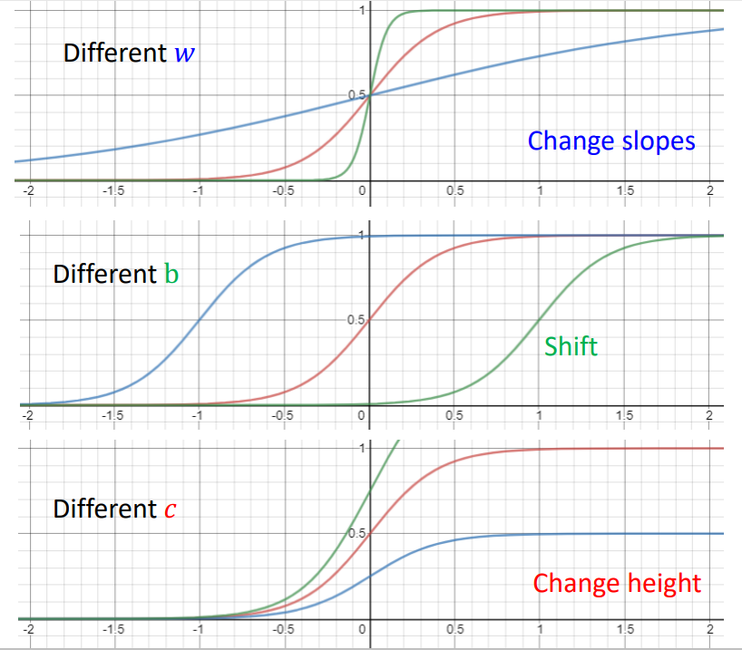


简单的Linear Model无法拟合复杂的问题，通过sigmoid function的叠加形成的Piecewise Linear Curves则可以
$$
y = b + wx_1 \\
⬇\\
y = b + \sum\limits_i\ c_i\ sigmoid(b_i+w_ix_1)
$$

多变量
$$
y = b + \sum\limits_jw_jx_j\\
⬇\\
y = b + \sum\limits_i c_i\ sigmoid(b_i+\sum\limits_j(w_{ij}x_j))
$$
> 其中
>
> - i：sigmoid function个数
> - j：feature个数
> - b：constant
> - bi：bias
>


在 $y = b + \sum\limits_i c_i\ sigmoid(b_i+\sum\limits_j(w_{ij}x_j))$ 中

- wij（weight for xj for i-th sigmoid）：第i个激活函数中的第j个特征的权重

- $r_i = b_i+\sum\limits_j(w_{ij}x_j)$ ：第i个激活函数的参数值

取i = j = 3，就有
$$
r_1 = b_1 + w_{11}x_1 + w_{12}x_2 + w_{13}x_3\\
r_2 = b_2 + w_{21}x_1 + w_{22}x_2 + w_{23}x_3\\
r_3 = b_3 + w_{31}x_1 + w_{32}x_2 + w_{33}x_3\\
$$

改写成向量的形式，就有
$$
\left[\begin{matrix}r_1\\r_2\\r_3\end{matrix}\right] = \left[\begin{matrix}b_1\\b_2\\b_3\end{matrix}\right] +
\left[\begin{matrix}w_{11}&w_{12}&w_{13}\\w_{21}&w_{22}&w_{23}\\w_{31}&w_{32}&w_{33}\end{matrix}\right]
\left[\begin{matrix}x_1\\x_2\\x_3\end{matrix}\right]
$$


简化形式，就有
$$
r = b + Wx
$$
> 其中
>
> - r，b，x是3*1的列向量
> - W是3*3的矩阵

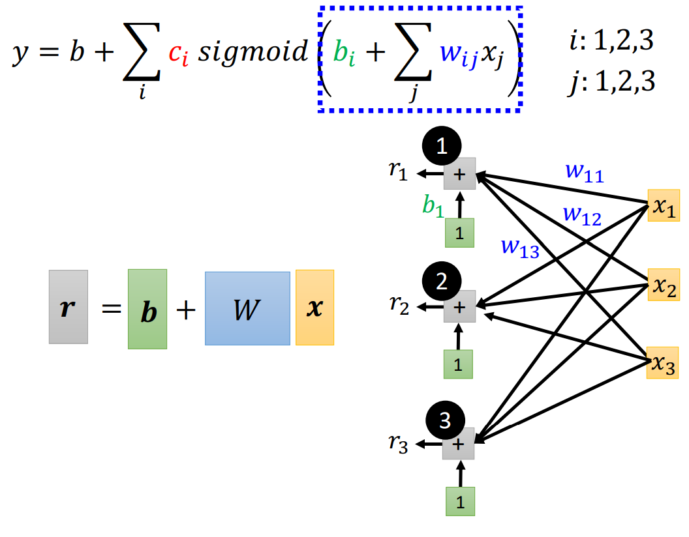

参数ri通过sigmoid函数得到ai，ai组成a，即
$$
r_i = b_i+\sum\limits_j(w_{ij}x_j)\\
⬇\\
a_i = sigmoid(r_i)\\
⬇\\
 
$$


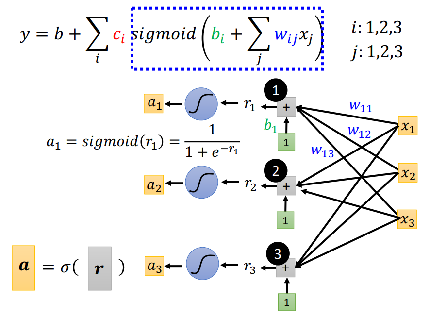

所以
$$
\begin{align*}\label{2}
&y = b + c_1*a_1 + c_2*a_2 + c_3*a_3 \\ \\
&y = b+
\left[\begin{matrix}c_1&c_2&c_3\end{matrix}\right]
\left[\begin{matrix}a_1\\a_2\\a_3\end{matrix}\right]
\\\\
&y = b + c^T a
\end{align*}
$$

带入a = σ(r)就有
$$
y=b+c^T\ σ(b+Wx)
$$


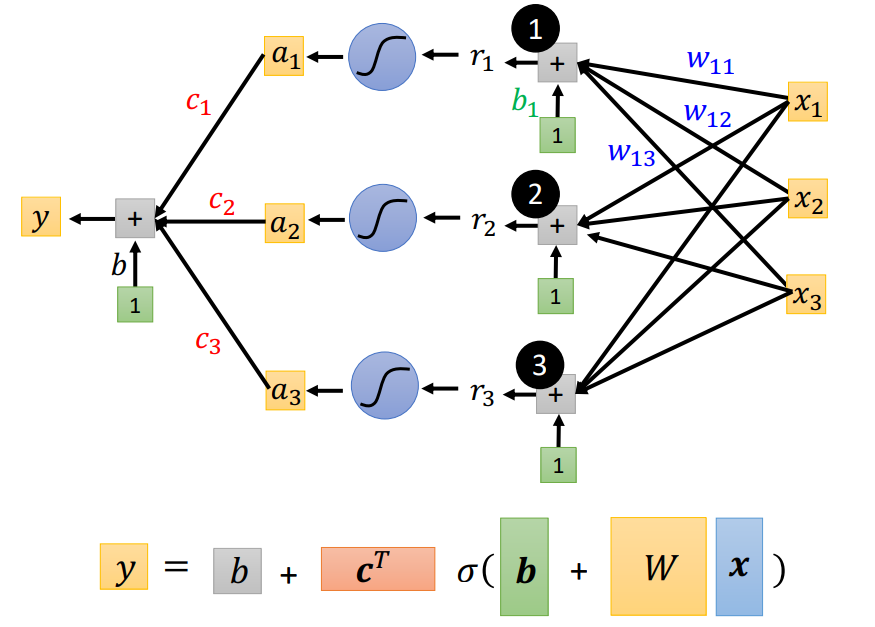

对于 $y=b+c^T\ σ(b+Wx)$

- feature：x

- unknown parameters

  - 矩阵W

  - 向量cT

  - b

    - 第一个b是常量

    - 第二个b是向量

将unknown parameters全部一起拼成新的向量θ

- 矩阵W需要划分为向量组（row或col）再和cT、b、b一起拼接

$$
θ=\left[\begin{matrix}θ_1\\θ_2\\θ_3\\\vdots\end{matrix}\right]
$$

对于 $y=b+c^T\ σ(b+Wx)$ 就是一个含有未知参数θ的model，给定一组θ值代入，就可以求得Loss
$$
Loss: L = \frac{1}{N}\sum|y-\bar{y}|
$$
然后对其进行最优化
$$
θ^* = arg\underset{θ}{min} L
$$

1. (Randomly) Pick an initial value $θ^0$

2. computer gradient
   $$
   g=\left[\begin{matrix}
   \frac{\partial L}{\partial θ_1}|_{θ = θ^0}\\
   \frac{\partial L}{\partial θ_2}|_{θ = θ^0}\\
   \frac{\partial L}{\partial θ_3}|_{θ = θ^0}\\
   \vdots
   \end{matrix}\right]
   $$

   即求g的全微分
   $$
   g=\nabla L(θ^0)
   $$

3. update θ

   
   $$
   \left[\begin{matrix}
   θ_1^1\\θ_2^1\\θ_3^1\\\vdots
   \end{matrix}\right]
   =
   \left[\begin{matrix}
   θ_1^0\\θ_2^0\\θ_3^0\\\vdots
   \end{matrix}\right]
   -
   \left[\begin{matrix}
   η\frac{\partial L}{\partial θ_1}|_{θ = θ^0}\\
   η\frac{\partial L}{\partial θ_2}|_{θ = θ^0}\\
   η\frac{\partial L}{\partial θ_3}|_{θ = θ^0}\\
   \vdots
   \end{matrix}\right]
   $$

   即
   $$
   \theta^1=\theta^0-\eta g
   $$

> η：learning rate


#### ReLU

Rectified Linear Unit
$$
y = c * max(0,b+wx_1)
$$
则model为
$$
y = b + \sum\limits_{2i} c_i * \ max(0,b_i+\sum\limits_j(w_{ij}x_j))
$$

### Batch

将数据集随机分成多个batch

1. 用第一个batch的数据来算Loss：L1

2. 用L1来算出g
   $$
   g=\nabla L^1(θ^0)
   $$

3. 用g来更新参数θ
   $$
   \theta^1=\theta^0-\eta g
   $$

4. 再用第二个batch的数据来算Loss：L2

5. 用L2来算出g

6. 用g来更新参数θ

7. ......

每一次的batch更新参数，叫做一次Updata，**将所有的batch计算看成一次，叫做epoch**

- 一次epoch是不知道有多少次Updata的，取决于batch size
  - 有多少个batch就有多少次Update

- batch size是一个HyperParameter

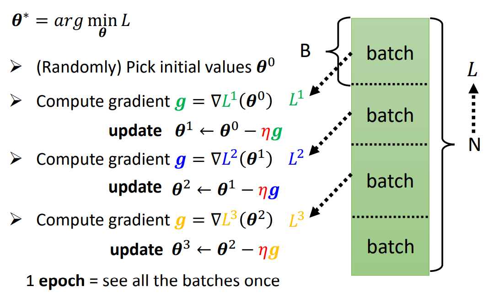

## 神经元

`Neuron`

1. 上述通过sigmoid function叠加出来的的Model就是**神经元模型**（Neuron）
2. 多层Neuron连接起来就是神经网络（Neural Networks）
3. 除开输入输出层，中间的Neuron就叫做Hidden Layer，整个模型就叫Deep Learning

> 计算出a后并不直接算出y，而是将a作为新的sigmoid函数的输入x继续拟合，向前传递
> $$
> a_i = sigmoid(b_i+\sum\limits_j(w_{ij}x_j))
> $$

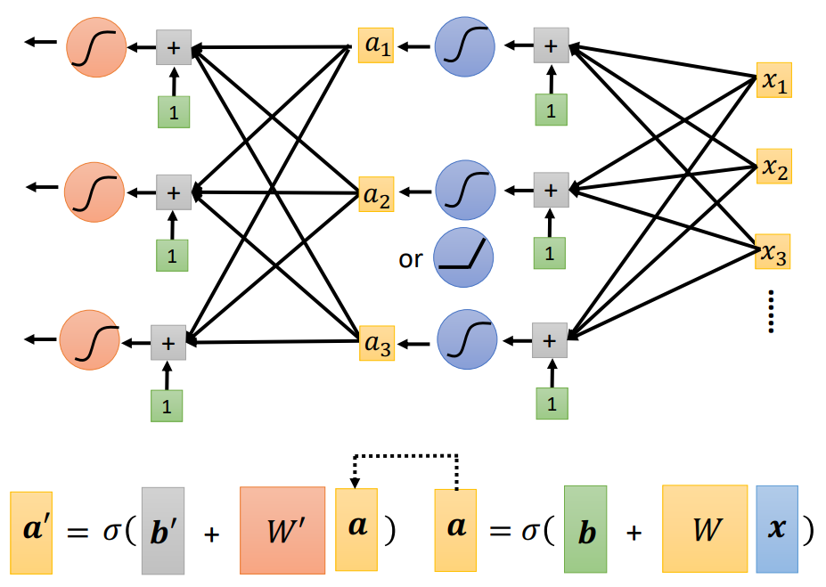

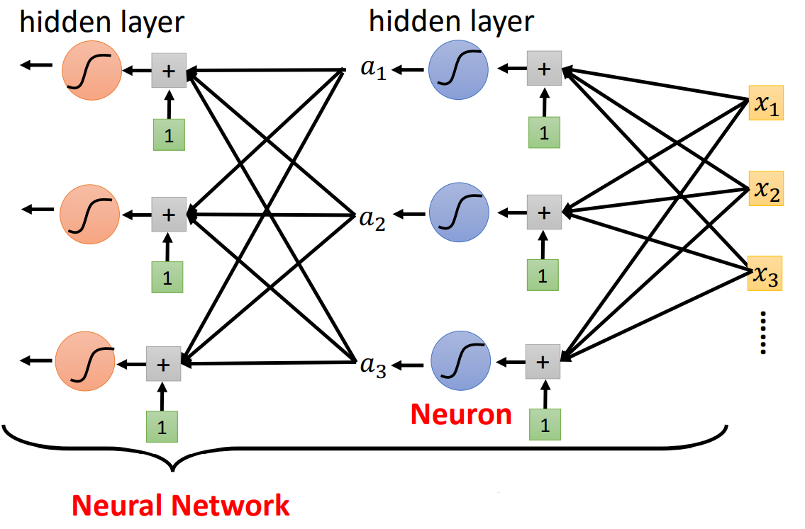


## 过拟合

`Overfitting`


# PyTorch

An open source **machine learning framework**

A Python package that provides two high-level features

- **Tensor** computation（like NumPy）with strong GPU acceleration
- Deep neural networks built on a tape-based autograd system

> Facebook AI 

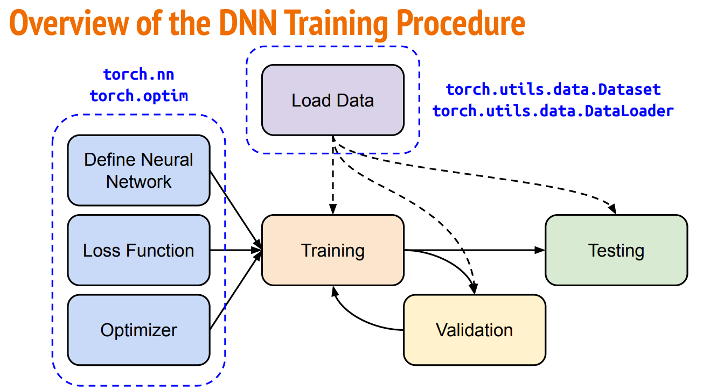

## Tensor

**张量**

- torch中的一种数据结构：High-dimensional matrix (array)，即各种维度的数组


### Data Type

| Data type               | dtype       | tensor            |
| ----------------------- | ----------- | ----------------- |
| 32-bit floating point   | torch.float | torch.FloatTensor |
| 64-bit integer (signed) | torch.long  | torch.LongTensor  |

### shape

- **1-D tensor**
  - （3，）
- **2-D tensor**
  - （dim0，dim1）
- **3-D tensor**
  - （dim0，dim1，dim2）

> dimension：dim in PyTorch == axis in NumPy
>
> dim0：三维的高度

`x.shape`：返回`torch.Size`

### Constructor

- **From list / NumPy array** 
  - `x = torch.tensor([[1, -1], [-1, 1]])` 
  - `x = torch.from_numpy(np.array([[1, -1], [-1, 1]]))`
- **Specify shape**
  - Zero tensor 
    - `x = torch.zeros([2, 2])` 
  - Unit tensor 
    - `x = torch.ones([1, 2, 5])`

### Operator

- Squeeze：remove the specified dimension with length = 1（降维）
- Unsqueeze：expand a new dimension（升维）
- Transpose：transpose two specified dimensions（转置）
- Cat：concatenate multiple tensors（拼接）

```python
x = torch.zeros([1, 2, 3])
# dim0
x = x.squeeze(0)
# torch.Size([2, 3])
x.shape

x = torch.zeros([2, 3])
# dim1
x = x.unsqueeze(1)
# torch.Size([2, 1, 3])
x.shape

x = torch.zeros([2, 3])
x = x.transpose(0, 1)
# torch.Size([3, 2])
x.shape


x = torch.zeros([2, 1, 3])
y = torch.zeros([2, 3, 3])
z = torch.zeros([2, 2, 3])
# dim1
w = torch.cat([x, y, z], dim=1)
# torch.Size([2, 6, 3])
w.shape


z = x + y
z = x - y
y = x.pow(2)
y = x.sum()
y = x.mean()
```

## Device

Default

- tensors & modules will be computed with **CPU**

`model = MyModel().to(device)`

- CPU：`x = x.to('cpu')`
- GPU：`x = x.to('cuda')`

 **GPU**

1. Check if your computer has NVIDIA GPU：`torch.cuda.is_available()`
2. Multiple GPUs：specify 'cuda:0', 'cuda:1'...

> Parallel computing：拆分矩阵运行

## Gradient

计算矩阵微分

`backward()`

1. 矩阵
   $$
   x=
   \left[
   \begin{matrix}
   1&0\\-1&1
   \end{matrix}
   \right]
   $$

2. 矩阵
   $$
   z=\sum_i\sum_j x_{i,j}^2
   $$

3. 计算
   $$
   \frac{\partial z}{\partial x_{i,j}}=2x_{i,j}
   $$

4. 结果
   $$
   \frac{\partial z}{\partial x}=
   \left[
   \begin{matrix}
   2&0\\-2&2
   \end{matrix}
   \right]
   $$

```python
x = torch.tensor([[1., 0.], [-1., 1.]], requires_grad=True)
z = x.pow(2).sum()
# 计算微分
z.backward()
# 查看 tensor([[ 2., 0.],[-2., 2.]])
x.grad
```

## Data

**DataSet**

```python
from torch.utils.data import Dataset

class MyDataset(Dataset):
    # Read data & preprocess 读数据，预处理
    def __init__(self, file):
      self.data = ...
    # Returns one sample at a time
    def __getitem__(self, index):
      return self.data[index]
    # Returns the size of the dataset
    def __len__(self):
      return len(self.data)
```

**DataLoader**

shuffle

- Training：True
- Testing：False

```python
from torch.utils.data import DataLoader

dataset = MyDataset(file)
tr_set = DataLoader(dataset, batch_size, shuffle=True)
```

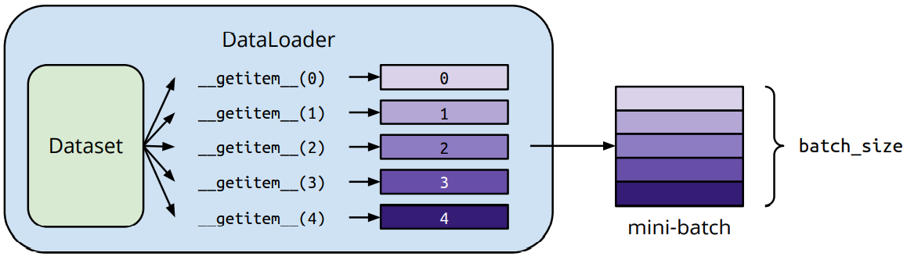


## Neural  Network

`torch.nn`

### Linear Layer

`nn.Linear(in_features, out_features)`

- in_features
- out_features

> in/out_features可以是任意维
>
> *表示任意，但必须要满足矩阵乘法

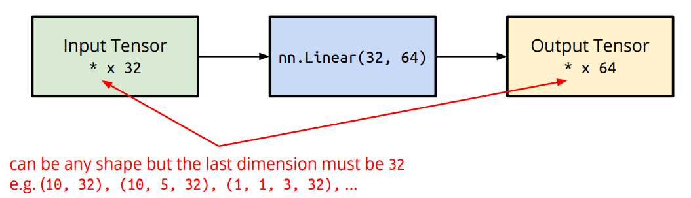

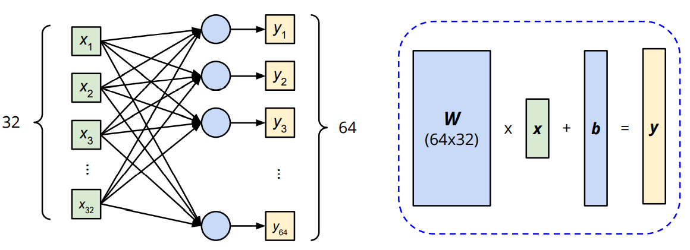

```python
import torch.nn as nn

layer = torch.nn.Linear(32, 64)
# W:torch.Size([64, 32])
layer.weight.shape
# b:torch.Size([64])
layer.bias.shape
```


### Activation Function

- Sigmoid Activation 
  - `nn.Sigmoid()`
- ReLU Activation 
  - `nn.ReLU()`


### Loss Function

`criterion = nn.MSELoss()`

- Mean Squared Error (for linear regression)
  - `nn.MSELoss()`
- Cross Entropy (for classification)
  - `nn.CrossEntropyLoss()`


### Build

- `nn.Sequential()`
- `forward()`

```python
import torch.nn as nn

class MyModel(nn.Module):
    # Initialize your model & define layers
    def __init__(self):
    	super(MyModel, self).__init__()
		self.net = nn.Sequential(
 			nn.Linear(10, 32),
 			nn.Sigmoid(),
 			nn.Linear(32, 1)
 		)
    # Compute output of your NN
    def forward(self, x):
 		return self.net(x)
```


### Optimizer

`torch.optim`

Stochastic Gradient Descent (SGD)

```python
# params: model.parameters()
# lr: learning rate η
optimizer = torch.optim.SGD(params, lr, momentum = 0)
```


## Training

**准备**

1. Read data via MyDataset
2. Put dataset into Dataloader
3. Contruct model and move to device (cpu/cuda)
4. Set loss function
5. Set optimizer

**训练**

```python
for epoch in range(n_epochs):
    # set model to train mode
    model.train()
    for x, y in tr_set:
        # set gradient to zero
        optimizer.zero_grad()
        # move data to device (cpu/cuda)
        x, y = x.to(device), y.to(device)
        # forward pass (compute output)
        pred = model(x)
        # compute loss
        loss = criterion(pred, y)
        # compute gradient (backpropagation)
        loss.backward()
        # update model with optimizer
        optimizer.step()
```

**Evaluation**

Validation

```python
# set model to evaluation mode
model.eval()
total_loss = 0

for x, y in dv_set:
    x, y = x.to(device), y.to(device)
    # disable gradient calculation
    with torch.no_grad():
        # forward pass (compute output)
        pred = model(x)
        # compute loss
        loss = criterion(pred, y)
        # accumulate loss
        total_loss += loss.cpu().item() * len(x)

# compute averaged loss       
avg_loss = total_loss / len(dv_set.dataset)
```

Testing

```python
# set model to evaluation mode
model.eval()
preds = []
# test dataset
for x in tt_set:
    x = x.to(device)
    with torch.no_grad():
        pred = model(x)
        # collect predictio
        preds.append(pred.cpu())
```


## Save/Load

- **Save**
  - `torch.save(model.state_dict(), path)` 
- **Load** 
  - `ckpt = torch.load(path)` 
  - `model.load_state_dict(ckpt)`

# 深度学习

`Deep Learning`

- Deep =  Many Hidden Layers

> 为什么要用DL
>
> 

## 神经网络

ANN：Aritificial Neural Networks

- 简称为神经网络NN：Neural Networks

> 生物神经网络：神经元的电位超过一个阈值threshold，那么它就会被激活（兴奋），向其他神经元发送化学物质

### 基本思想

通过大量**简单的神经元**之间的相互连接来**构造复杂的网络结构**，信号（数据）可以在这些神经元之间传递，通过激活不同的神经元和对传递的信号进行**加权**来使得信号被放大或衰减，经过多次的传递来改变信号的强度和表现形式

> 不同的激活函数，不同的结果

### MCP模型

模拟大脑，MCP模型将神经元简化为了三个过程

1. 输入信号**线性加权**
2. 求和
3. **非线性激活**（阈值法）

### 神经元

[神经元模型](# 神经元)

- 把一个Logistic Regression称之为一个Neuron，多个Neuron连接就成为一个Neural Network
- 每个LR都有自己的wight和bias，所有的LR的weight和bias集合起来就是这个NN的parameter（θ）
  - θ通过training data得出

### Structure

LR通过不同的连接方式就可以得到不同的NN

定义了NN的structure，就相当于define了一个function set（通过给NN设定不同的参数，变成不同的function）

- **决定有多少个hidden layer**
- **决定每个hidder layer有多少个Neuron**

通过数据训练确 定了θ，就确定了一个function

- 通过input vector就可以得到output vector

### 全连接前向传播神经网络

`Fully Connect Feedforward NetWork`

- 一排2个Neuron，两两连接

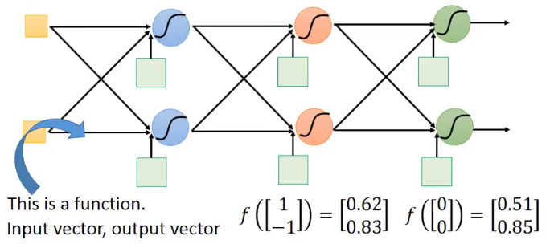


### 矩阵计算

Matrix Operation：矩阵计算**可以使用GPU加速**

- 将每一个layer的weight集合起来，作为矩阵w1
- 将每一个layer的bias集合起来，作为向量b1

计算过程

1. 输入input vector X，计算a1
   $$
   a_1 = sigmoid(w^1x+b^1)
   $$

2. 将a1当成input vector ，计算a2
   $$
   a_2 = sigmoid(w^2a_1+b^2)\\
   ⬇\\
   a_2 = sigmoid(w^2sigmoid(w^1x+b^1)+b^2)
   $$

1. 层层计算，得到output vector Y

> 一连串的矩阵计算

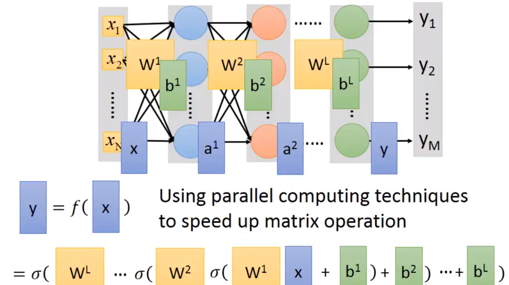

### Output Layer

**Feature**

- Output Layer的输入feature不是直接从输入X抽取出来的，而是**通过多个hidden layer的计算后抽取出来的一组feature** 


> 相当于自动进行了特征提取（feature extractor）来代替了手动的特征工程（feature engineering）

**Softmax**

- Multi-class Classifier要通过一个Softmax function
- 一般将Output Layer也看成是一个Multi-class Classifier，所以最后一层会加上Softmax function

> Softmax：将概率归一化，使得所有分类概率和为1

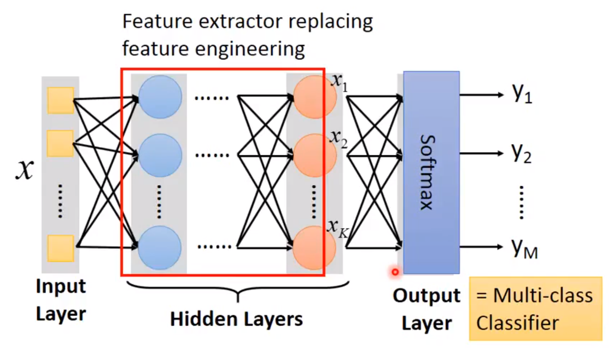


# 感知机

Perceptrons

- 感知机本质上是一种**线性模型**（linear model），其实就是**两层神经元组成的神经网络**，使用MCP模型对输入的多维数据进行二分类**classification**


- 它只有输出层神经元进行activation function处理，即只有一层功能神经元（function neuron），学习能力有限，**只能处理线性分类问题**，就连最简单的XOR（异或）问题都无法正确分类

$$
f(x)=sign(w*x+b)
$$

$$
sign(x)=
\left\{
\begin{aligned}
+1, \quad x\ge0\\
-1, \quad x\lt0\\
\end{aligned}
\right.
$$


> 只有线性可分的时候perceptron才能达到收敛converge，异或问题是线性不可分的，需要使用多层Perceptron
>
> Model Bias：Linear models have severe limitation（表达能力弱）

- 输入层（特征向量）
- 隐含层
- 输出层（分类结果）


# 多层感知机

MLP：Multilayer Perceptrons

有多个隐含层（hidden layer）的Perceptrons

> hidden layer 和output layer都是function neuron

可以使用反向传播BP算法，然后使用Sigmoid激活函数进行非线性映射，解决非线性分类和学习的问题


# 反向传播BP算法

`Backpropagation`：BP

**梯度消失问题**

在**误差梯度**后项传递的过程中，后层梯度以乘性方式叠加到前层，由于Sigmoid函数的饱和特性，后层梯度本来就小，误差梯度传到前层时几乎为0，因此无法对前层进行有效的学习

**解决方案**

- 无监督预训练（对权值进行初始化） + 有监督训练微调

- ReLU激活函数能够有效的抑制梯度消失问题（不再需要预训练和微调）

