[李宏毅2021春机器学习课程视频](https://www.bilibili.com/video/BV1Wv411h7kN?p=1)

[李宏毅2021春机器学习课程主页](https://speech.ee.ntu.edu.tw/~hylee/ml/2021-spring.html)

# 机器学习

`Machine Learning` ≈ Looking For Function

- **回归Regression**
  - The function outputs a scalar
- **分类Classification**
  - Given options (classes)，the function outputs the correct one
- **结构化Structured Learning**
  - create something with  structure (image, document)

> 回归：连续
>
> 分类：离散

## 监督学习

`supervised learning`

### 模型

`model`

- 带有未知的parameter的function


**线性模型Linear models**

$y = b + wx$

- x：feature

- w：weight 
- b：bias

### 损失函数

Loss：`L(b,w)`

其中，y是输出，$\bar{y}$是监督数据，n是数据的维数

- **平均绝对误差**MAE（Mean Absolute Error）： |$y^n-\bar{y^n}$|
- **均方误差**MSE（Mean Square Error）： $\frac{1}{2}\sum\limits_n(y^n-\bar{y^n})^2$
- **均方根误差**RMSE（Root Mean Squard Error）：$\sqrt{\frac{1}{n}\sum\limits_n(f(x^n)-\bar y^n)^2}$
- **交叉熵误差**CEE（Cross Entropy Error）：$-\sum\limits_n\bar{y^n}logy^n$
  - log以e为底
  - 其中$\bar{y^n}$用one-hot表示，只有正确标签的索引才为1，其余均为0，所以只输出正确标签的对数


> Define Loss  from Training Data
>
> 一般将输出y用softmax处理，监督数据$\bar{y}$用one-hot表示

计算损失函数必须把所有的训练数据都作为对象，所有要把所有数据的LOSS加起来，然后再平均化得到平均损失函数
$$
LOSS = -\frac1K\sum\limits_K\sum\limits_n\bar{y^n}logy^n
$$

#### mini-batch

用全部数量的训练数据计算LOSS开销太大

- 用随机选择的小批量数据作为全体数据的近似值

### 最优化

`Optimization`

$w^*,b^* = arg\underset{w,b}{min} L$

> arg min：求得使Loss最小的参数w和b

对于损失函数来说，Loss is a function of  parameters，所以对LOSS函数求导，来判断如何改变权重参数的值，能使得函数值发生何种变化

- 如果导数为正，那么将权重参数值负方向改变，就可以减少LOSS函数值
- 如果导数为负，那么将权重参数值正方向改变，就可以减少LOSS函数值
- 如果导数为0时，无论怎么改变权重参数值，LOSS函数都不会变化，此时更新就会结束

#### 梯度下降

`Gradient Descent`

- 使用梯度信息决定前进方向

- 梯度只能表示当前函数值减小最多的方向，而不是最小值的方法，所以容易陷入局部最优解（local minima）而得不到全局最优解（global minima）


> 负梯度方向，LOSS下降最快

1. (Randomly) Pick an initial value $(w^0，b^0)$

2. computer 
   $$
   \frac{\partial L}{\partial w}|_{w = w^0,b = b^0}\\
   \frac{\partial L}{\partial b}|_{w = w^0,b = b^0}
   $$

3. update
   $$
   w^1 = w^0 - η\ \frac{\partial L}{\partial w}|_{w = w^0,b = b^0}\\
   b^1 = b^0 - η\ \frac{\partial L}{\partial b}|_{w = w^0,b = b^0}
   $$
   

> η：learning rate
>
> - negative：increase w,b
> - positive：decrease w,b
>
> 学习率一般事先设定好，然后在学习中也会改变值，来确认学习是否正确进行了

### 超参数

`HyperParameter`

机器学习模型中一般有两类参数

- 一类需要从数据中学习和估计得到，称为**模型参数**（Parameter），即**模型本身的参数**，比如
  - 线性回归直线的加权系数w（斜率）
  - 线性回归直线的偏差项b（截距）
- 一类则是机器学习算法中的**调优参数**（Tuning Parameters），需要**人为设定**，称为**超参数**（HyperParameter），比如
  - 正则化系数λ
  - 决策树模型中树的深度
  - 梯度下降法中的学习率η
  - k近邻法中的k（最相近的点的个数）
  - **迭代次数epoch**
  - **批量大小batch size**

> 机器学习中的调参，实际上是调超参数

### 分段线性曲线

`Piecewise Linear Curves`

1. 分段函数（piecewise function）其实就是Hard sigmoid function
   1. sigmoid function其实也是一个HyperParameter（人工设定个数）
2. Piecewise Linear Curves = **Constant + sum of a set of Piecewise function**
3. 再用Piecewise Linear Curves去逼近出各种Continuous function

### 激活函数

`Activation Function`

#### Sigmoid

- sigmoid function是一个在生物学中常见的**S型的函数**，也称为S型生长曲线
- 在信息科学中由于其**单增以及反函数单增**等性质，sigmoid function常被用作**神经网络的阈值函数**（将变量映射到[0,1]之间）

$$
y = c\ \frac{1}{1+e^{-(b+wx_1)}}\\
⬇\\
y = c\ sigmoid(b+wx_1)
$$

修改c，b，w​来逼近各种各样的piecewise function，从而得到各种Piecewise Linear Curves


简单的Linear Model无法拟合复杂的问题，通过sigmoid function的叠加形成的Piecewise Linear Curves则可以
$$
y = b + wx_1 \\
⬇\\
y = b + \sum\limits_i\ c_i\ sigmoid(b_i+w_ix_1)
$$

多变量
$$
y = b + \sum\limits_jw_jx_j\\
⬇\\
y = b + \sum\limits_i c_i\ sigmoid(b_i+\sum\limits_j(w_{ij}x_j))
$$
> 其中
>
> - i：sigmoid function个数
> - j：feature个数
> - b：constant
> - bi：bias
>


在 $y = b + \sum\limits_i c_i\ sigmoid(b_i+\sum\limits_j(w_{ij}x_j))$ 中

- wij（weight for xj for i-th sigmoid）：第i个激活函数中的第j个特征的权重

- $r_i = b_i+\sum\limits_j(w_{ij}x_j)$ ：第i个激活函数的参数值

取i = j = 3，就有
$$
r_1 = b_1 + w_{11}x_1 + w_{12}x_2 + w_{13}x_3\\
r_2 = b_2 + w_{21}x_1 + w_{22}x_2 + w_{23}x_3\\
r_3 = b_3 + w_{31}x_1 + w_{32}x_2 + w_{33}x_3\\
$$

改写成向量的形式，就有
$$
\left[\begin{matrix}r_1\\r_2\\r_3\end{matrix}\right] = \left[\begin{matrix}b_1\\b_2\\b_3\end{matrix}\right] +
\left[\begin{matrix}w_{11}&w_{12}&w_{13}\\w_{21}&w_{22}&w_{23}\\w_{31}&w_{32}&w_{33}\end{matrix}\right]
\left[\begin{matrix}x_1\\x_2\\x_3\end{matrix}\right]
$$


简化形式，就有
$$
r = b + Wx
$$
> 其中
>
> - r，b，x是3*1的列向量
> - W是3*3的矩阵


参数ri通过sigmoid函数得到ai，ai组成a，即
$$
r_i = b_i+\sum\limits_j(w_{ij}x_j)\\
⬇\\
a_i = sigmoid(r_i)\\
⬇\\
$$


所以
$$
\begin{align*}\label{2}
&y = b + c_1*a_1 + c_2*a_2 + c_3*a_3 \\ \\
&y = b+
\left[\begin{matrix}c_1&c_2&c_3\end{matrix}\right]
\left[\begin{matrix}a_1\\a_2\\a_3\end{matrix}\right]
\\\\
&y = b + c^T a
\end{align*}
$$

带入a = σ(r)就有
$$
y=b+c^T\ σ(b+Wx)
$$


对于 $y=b+c^T\ σ(b+Wx)$

- feature：x

- unknown parameters

  - 矩阵W

  - 向量cT

  - b

    - 第一个b是常量

    - 第二个b是向量

将unknown parameters全部一起拼成新的向量θ

- 矩阵W需要划分为向量组（row或col）再和cT、b、b一起拼接

$$
θ=\left[\begin{matrix}θ_1\\θ_2\\θ_3\\\vdots\end{matrix}\right]
$$

对于 $y=b+c^T\ σ(b+Wx)$ 就是一个含有未知参数θ的model，给定一组θ值代入，就可以求得Loss
$$
Loss: L = \frac{1}{N}\sum|y-\bar{y}|
$$
然后对其进行最优化
$$
θ^* = arg\underset{θ}{min} L
$$

1. (Randomly) Pick an initial value $θ^0$

2. computer gradient
   $$
   g=\left[\begin{matrix}
   \frac{\partial L}{\partial θ_1}|_{θ = θ^0}\\
   \frac{\partial L}{\partial θ_2}|_{θ = θ^0}\\
   \frac{\partial L}{\partial θ_3}|_{θ = θ^0}\\
   \vdots
   \end{matrix}\right]
   $$

   即求g的全微分
   $$
   g=\nabla L(θ^0)
   $$

3. update θ

   
   $$
   \left[\begin{matrix}
   θ_1^1\\θ_2^1\\θ_3^1\\\vdots
   \end{matrix}\right]
   =
   \left[\begin{matrix}
   θ_1^0\\θ_2^0\\θ_3^0\\\vdots
   \end{matrix}\right]
   -
   \left[\begin{matrix}
   η\frac{\partial L}{\partial θ_1}|_{θ = θ^0}\\
   η\frac{\partial L}{\partial θ_2}|_{θ = θ^0}\\
   η\frac{\partial L}{\partial θ_3}|_{θ = θ^0}\\
   \vdots
   \end{matrix}\right]
   $$

   即
   $$
   \theta^1=\theta^0-\eta g
   $$

> η：learning rate


#### ReLU

Rectified Linear Unit
$$
y = c * max(0,b+wx_1)
$$
则model为
$$
y = b + \sum\limits_{2i} c_i * \ max(0,b_i+\sum\limits_j(w_{ij}x_j))
$$

### Batch

将数据集随机分成多个batch

1. 用第一个batch的数据来算Loss：L1

2. 用L1来算出g
   $$
   g=\nabla L^1(θ^0)
   $$

3. 用g来更新参数θ
   $$
   \theta^1=\theta^0-\eta g
   $$

4. 再用第二个batch的数据来算Loss：L2

5. 用L2来算出g

6. 用g来更新参数θ

7. ......

每一次的batch更新参数，叫做一次Updata，**将所有的batch计算看成一次，叫做epoch**

- 一次epoch是不知道有多少次Updata的，取决于batch size
  - 有多少个batch就有多少次Update

- batch size是一个HyperParameter


## 神经元

`Neuron`

1. 上述通过sigmoid function叠加出来的的Model就是**神经元模型**（Neuron）
2. 多层Neuron连接起来就是神经网络（Neural Networks）
3. 除开输入输出层，中间的Neuron就叫做Hidden Layer，整个模型就叫Deep Learning

> 计算出a后并不直接算出y，而是将a作为新的sigmoid函数的输入x继续拟合，向前传递
> $$
> a_i = sigmoid(b_i+\sum\limits_j(w_{ij}x_j))
> $$


## 过拟合

`Overfitting`

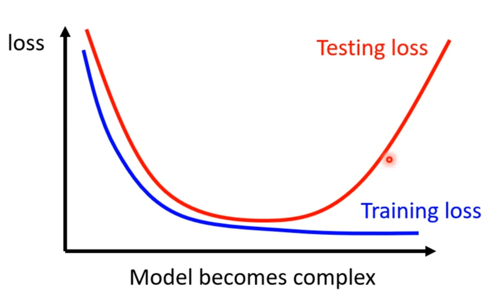

**解决方法**

- more training data
- data augmentation
- constrained model
  - less parameters
  - less features
  - early stopping
  - dropout

> 永远不要用测试集参与训练

# PyTorch

An open source **machine learning framework**

A Python package that provides two high-level features

- **Tensor** computation（like NumPy）with strong GPU acceleration
- Deep neural networks built on a tape-based autograd system

> Facebook AI 


## Tensor

**张量**

- torch中的一种数据结构：High-dimensional matrix (array)，即各种维度的数组


### Data Type

| Data type               | dtype       | tensor            |
| ----------------------- | ----------- | ----------------- |
| 32-bit floating point   | torch.float | torch.FloatTensor |
| 64-bit integer (signed) | torch.long  | torch.LongTensor  |

### shape

- **1-D tensor**
  - （3，）
- **2-D tensor**
  - （dim0，dim1）
- **3-D tensor**
  - （dim0，dim1，dim2）

> dimension：dim in PyTorch == axis in NumPy
>
> dim0：三维的高度

`x.shape`：返回`torch.Size`

### Constructor

- **From list / NumPy array** 
  - `x = torch.tensor([[1, -1], [-1, 1]])` 
  - `x = torch.from_numpy(np.array([[1, -1], [-1, 1]]))`
- **Specify shape**
  - Zero tensor 
    - `x = torch.zeros([2, 2])` 
  - Unit tensor 
    - `x = torch.ones([1, 2, 5])`

### Operator

- Squeeze：remove the specified dimension with length = 1（降维）
- Unsqueeze：expand a new dimension（升维）
- Transpose：transpose two specified dimensions（转置）
- Cat：concatenate multiple tensors（拼接）

```python
x = torch.zeros([1, 2, 3])
# dim0
x = x.squeeze(0)
# torch.Size([2, 3])
x.shape

x = torch.zeros([2, 3])
# dim1
x = x.unsqueeze(1)
# torch.Size([2, 1, 3])
x.shape

x = torch.zeros([2, 3])
x = x.transpose(0, 1)
# torch.Size([3, 2])
x.shape


x = torch.zeros([2, 1, 3])
y = torch.zeros([2, 3, 3])
z = torch.zeros([2, 2, 3])
# dim1
w = torch.cat([x, y, z], dim=1)
# torch.Size([2, 6, 3])
w.shape


z = x + y
z = x - y
y = x.pow(2)
y = x.sum()
y = x.mean()
```

## Device

Default

- tensors & modules will be computed with **CPU**

`model = MyModel().to(device)`

- CPU：`x = x.to('cpu')`
- GPU：`x = x.to('cuda')`

 **GPU**

1. Check if your computer has NVIDIA GPU：`torch.cuda.is_available()`
2. Multiple GPUs：specify 'cuda:0', 'cuda:1'...

> Parallel computing：拆分矩阵运行

## Gradient

计算矩阵微分

`backward()`

1. 矩阵
   $$
   x=
   \left[
   \begin{matrix}
   1&0\\-1&1
   \end{matrix}
   \right]
   $$

2. 矩阵
   $$
   z=\sum_i\sum_j x_{i,j}^2
   $$

3. 计算
   $$
   \frac{\partial z}{\partial x_{i,j}}=2x_{i,j}
   $$

4. 结果
   $$
   \frac{\partial z}{\partial x}=
   \left[
   \begin{matrix}
   2&0\\-2&2
   \end{matrix}
   \right]
   $$

```python
x = torch.tensor([[1., 0.], [-1., 1.]], requires_grad=True)
z = x.pow(2).sum()
# 计算微分
z.backward()
# 查看 tensor([[ 2., 0.],[-2., 2.]])
x.grad
```

## Data

**DataSet**

```python
from torch.utils.data import Dataset

class MyDataset(Dataset):
    # Read data & preprocess 读数据，预处理
    def __init__(self, file):
      self.data = ...
    # Returns one sample at a time
    def __getitem__(self, index):
      return self.data[index]
    # Returns the size of the dataset
    def __len__(self):
      return len(self.data)
```

**DataLoader**

shuffle

- Training：True
- Testing：False

```python
from torch.utils.data import DataLoader

dataset = MyDataset(file)
tr_set = DataLoader(dataset, batch_size, shuffle=True)
```


## Neural  Network

`torch.nn`

### Linear Layer

`nn.Linear(in_features, out_features)`

- in_features
- out_features

> in/out_features可以是任意维
>
> *表示任意，但必须要满足矩阵乘法


```python
import torch.nn as nn

layer = torch.nn.Linear(32, 64)
# W:torch.Size([64, 32])
layer.weight.shape
# b:torch.Size([64])
layer.bias.shape
```


### Activation Function

- Sigmoid Activation 
  - `nn.Sigmoid()`
- ReLU Activation 
  - `nn.ReLU()`


### Loss Function

`criterion = nn.MSELoss()`

- Mean Squared Error (for linear regression)
  - `nn.MSELoss()`
- Cross Entropy (for classification)
  - `nn.CrossEntropyLoss()`


### Build

- `nn.Sequential()`
- `forward()`

```python
import torch.nn as nn

class MyModel(nn.Module):
    # Initialize your model & define layers
    def __init__(self):
    	super(MyModel, self).__init__()
		self.net = nn.Sequential(
 			nn.Linear(10, 32),
 			nn.Sigmoid(),
 			nn.Linear(32, 1)
 		)
    # Compute output of your NN
    def forward(self, x):
 		return self.net(x)
```


### Optimizer

`torch.optim`

Stochastic Gradient Descent (SGD)

```python
# params: model.parameters()
# lr: learning rate η
optimizer = torch.optim.SGD(params, lr, momentum = 0)
```


## Training

**准备**

1. Read data via MyDataset
2. Put dataset into Dataloader
3. Contruct model and move to device (cpu/cuda)
4. Set loss function
5. Set optimizer

**训练**

```python
for epoch in range(n_epochs):
    # set model to train mode
    model.train()
    for x, y in tr_set:
        # set gradient to zero
        optimizer.zero_grad()
        # move data to device (cpu/cuda)
        x, y = x.to(device), y.to(device)
        # forward pass (compute output)
        pred = model(x)
        # compute loss
        loss = criterion(pred, y)
        # compute gradient (backpropagation)
        loss.backward()
        # update model with optimizer
        optimizer.step()
```

**Evaluation**

Validation

```python
# set model to evaluation mode
model.eval()
total_loss = 0

for x, y in dv_set:
    x, y = x.to(device), y.to(device)
    # disable gradient calculation
    with torch.no_grad():
        # forward pass (compute output)
        pred = model(x)
        # compute loss
        loss = criterion(pred, y)
        # accumulate loss
        total_loss += loss.cpu().item() * len(x)

# compute averaged loss       
avg_loss = total_loss / len(dv_set.dataset)
```

Testing

```python
# set model to evaluation mode
model.eval()
preds = []
# test dataset
for x in tt_set:
    x = x.to(device)
    with torch.no_grad():
        pred = model(x)
        # collect predictio
        preds.append(pred.cpu())
```


## Save/Load

- **Save**
  - `torch.save(model.state_dict(), path)` 
- **Load** 
  - `ckpt = torch.load(path)` 
  - `model.load_state_dict(ckpt)`

# 深度学习

`Deep Learning`

- Deep =  Many Hidden Layers

> Why DL
>
> - 任意一个连续的function，input vector（N维），output vector（M维）都可以用一个hidden layer的NN来表示，只要neuron够多

## 神经网络

ANN：Aritificial Neural Networks

- 简称为神经网络NN：Neural Networks

> 生物神经网络：神经元的电位超过一个阈值threshold，那么它就会被激活（兴奋），向其他神经元发送化学物质

### 基本思想

通过大量**简单的神经元**之间的相互连接来**构造复杂的网络结构**，信号（数据）可以在这些神经元之间传递，通过激活不同的神经元和对传递的信号进行**加权**来使得信号被放大或衰减，经过多次的传递来改变信号的强度和表现形式

> 不同的激活函数，不同的结果

### MCP模型

模拟大脑，MCP模型将神经元简化为了三个过程

1. 输入信号**线性加权**
2. 求和
3. **非线性激活**（阈值法）

### 神经元

[神经元模型](# 神经元)

- 把一个Logistic Regression称之为一个Neuron，多个Neuron连接就成为一个Neural Network
- 每个LR都有自己的wight和bias，所有的LR的weight和bias集合起来就是这个NN的parameter（θ）
  - θ通过training data得出

### Structure

LR通过不同的连接方式就可以得到不同的NN

定义了NN的structure，就相当于define了一个function set（通过给NN设定不同的参数，变成不同的function）

- **决定有多少个hidden layer**
- **决定每个hidder layer有多少个Neuron**

通过数据训练确 定了θ，就确定了一个function

- 通过input vector就可以得到output vector

### 全连接前向传播神经网络

`Fully Connected Feedforward NetWork`

- 一排2个Neuron，两两连接


### 矩阵计算

Matrix Operation：矩阵计算**可以使用GPU加速**

- 将每一个layer的weight集合起来，作为矩阵w1
- 将每一个layer的bias集合起来，作为向量b1

计算过程

1. 输入input vector X，计算a1
   $$
   a_1 = sigmoid(w^1x+b^1)
   $$

2. 将a1当成input vector ，计算a2
   $$
   a_2 = sigmoid(w^2a_1+b^2)\\
   ⬇\\
   a_2 = sigmoid(w^2sigmoid(w^1x+b^1)+b^2)
   $$

1. 层层计算，得到output vector Y

> 一连串的矩阵计算


### Output Layer

**Feature**

- Output Layer的输入feature不是直接从输入X抽取出来的，而是**通过多个hidden layer的计算后抽取出来的一组feature** 


> 相当于自动进行了特征提取（feature extractor）来代替了手动的特征工程（feature engineering）

**Softmax**

- Multi-class Classifier要通过一个Softmax function
- 一般将Output Layer也看成是一个Multi-class Classifier，所以最后一层会加上Softmax function

> Softmax：将概率归一化，使得所有分类概率和为1


## 训练

机器学习是数据驱动的方法，数据是机器学习的核心

1. 从输入数据中提取特征
   1. 特征指可以从输入数据中准确提取本质数据（重要数据）的转换器
   2. 特征通常表现为向量的形式
2. 再从这些特征中学习模式

> 避免人为介入，尝试从收集的数据学习某种模式pattern
>
> 机器学习还需要人为设定特征，深度学习连特征都由机器学习得到

### 数据集

分为训练数据集和测试数据集，正确评估模型的**泛化能力**

- x_train，x_test

> 泛化：处理未被观察过的数据的能力

# 反向传播BP算法

`Backpropagation`：BP

- 多层Hidden Layer，每层有成百上千个Neuron，导致**参数非常多**
  - 高维度的θ
- 需要有效的方法来计算Gradient Descent从而得到θ

## Chain Rule

- 链式求导法则
  - 复合函数求偏导

## BP算法计算

1. 将一组θ输入NN得到yn
2. yn与期望值y^n的距离函数定义为cn(θ)
   1. **交叉熵**
3. 所有的cn(θ)和定义为损失函数L(θ)
4. 所以对损失函数L(θ)求微分就转换为对cn(θ)求偏微分

> **损失函数（Loss function）是定义在单个训练样本上的**，也就是就算一个样本的误差

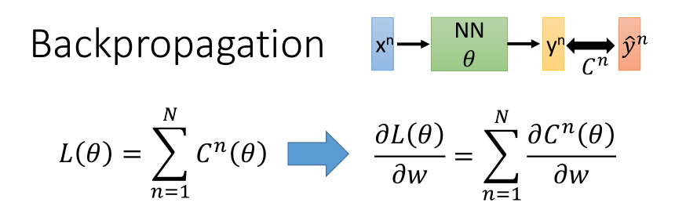

## 单神经元分析

将梯度计算分成两个部分

- 正向传播：Forward pass

- 反向传播：Backward pass

**过程**

cn(θ)对权重w求偏导可以拆分成

- Backward pass
  - cn(θ)对z求偏导
- Forward pass 
  - z对w求偏导

> $z = b+\sum\limits_i(w_ix_i)$ ：即z是激活函数的参数
>
> cn(θ)定义在最后

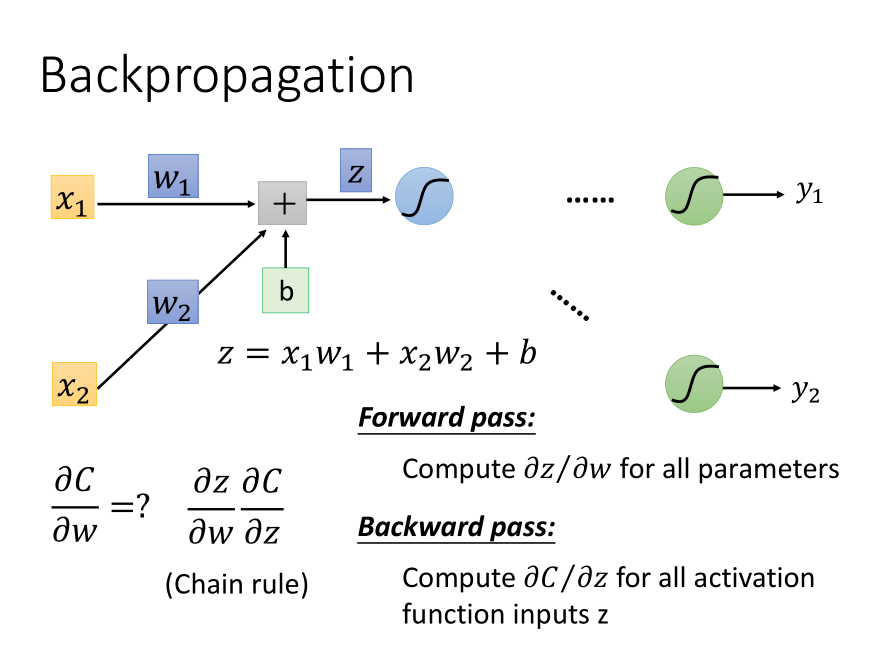

### 正向传播

z对w求偏微分的结果就是输入x的值

- 后面的偏导值就是前面的Hidden Layer的输出值

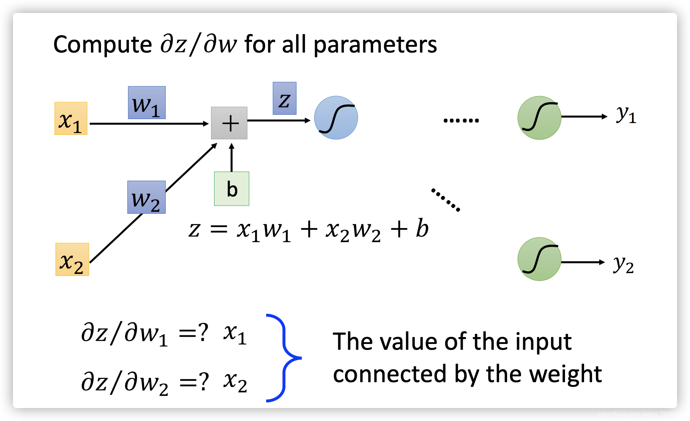

计算结果

- z对w=1和w=-2的偏微分都是-1
- 然后hidden的输出是0.12，即下一层的输入
  - 所以z对w=-1和w=-1的偏微分都是0.12

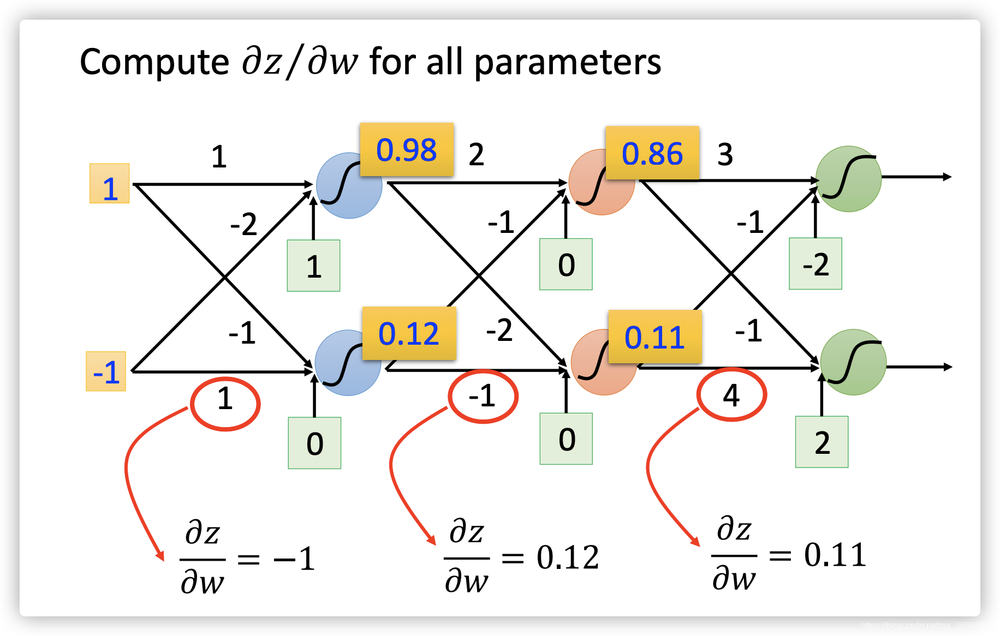

### 反向传播

难点在于cn(θ)是最后一层，中间会经过复杂的变换，所以另一部分偏导很难计算

> 激活函数使用Sigmod函数
>
> $a = sigmoid(z)$ ：即参数z经过激活函数后变成a

**正常过程**

1. 先只考虑下一步，将cn(θ)继续拆分为对sigmoid函数求偏导
2. 然后再将sigmoid函数对参数z求偏导
   1. sigmoid函数偏导结果是一个常数，**因为z在前向传播的时候就已经确定了**

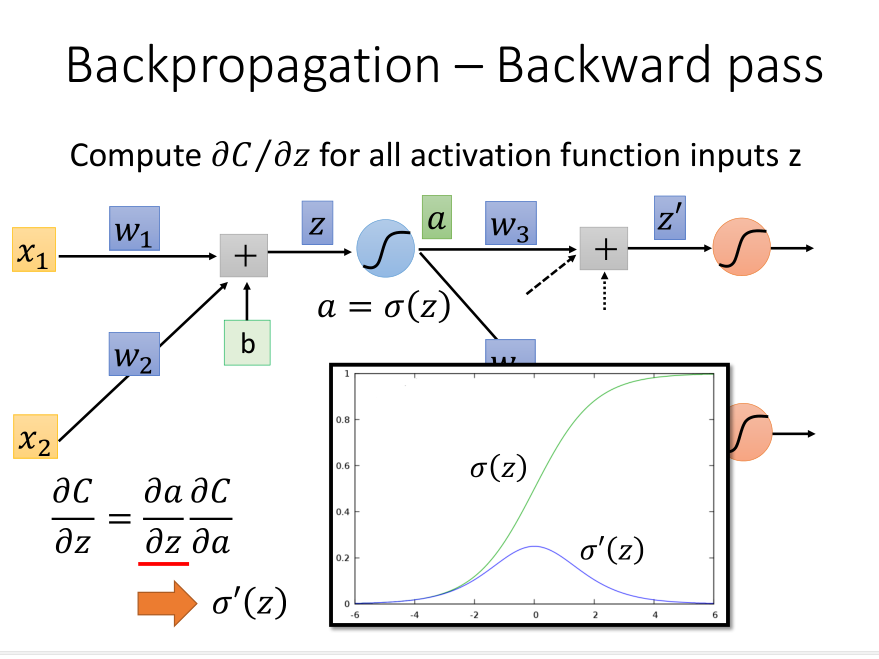

1. 而a会做为新的input，再参与下一组权重w的运算得到新的z'，即 $z' = b+\sum\limits_i(w_ia_i)$ 
2. 而新得到的z'会再后面影响到cn(θ)
3. 所以cn(θ)对a的偏导又可以拆分成
   1. cn(θ)对z'求偏导
   2. z'对a求偏导

> z'对a求偏导就和正向传播的z对x求偏导相似，值就是权重值w'

但是因为后续还有复杂的计算，所以cn(θ)对z'求偏导仍然是无法直接得到答案的，如果假设cn(θ)对z'求偏导答案已知

那么cn(θ)对的偏导结果就可以写成如下式子

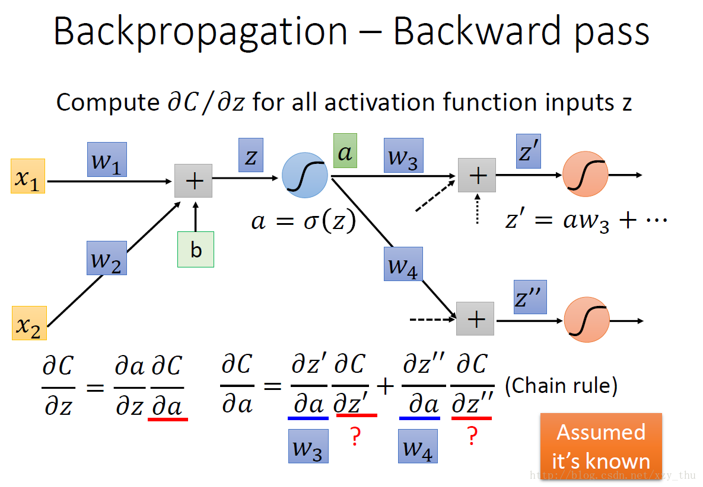

这个结果公式可以看成从反向构建的一个NN，正向传播的计算结果

- z'作为NN的输入，经过权重w运算，最后通过sigmoid对z偏导结果的放大就是cn(θ)对z的偏导结果

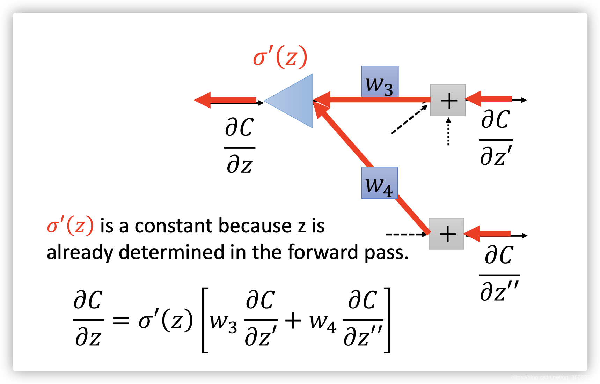

如果z'对应连接的的neuron刚好是output layer时，那么它们的值就是已知的输出

- 可以直接代入计算

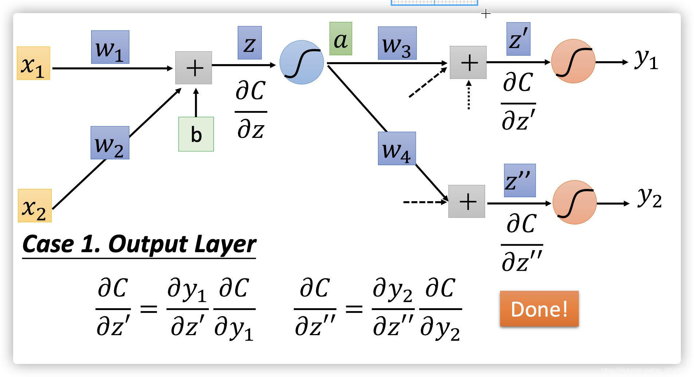

如果z'对应连接的neuron是hidden layer时，它的**值需要根据再后面一层来计算**

- 而**再后面一层又需要更后面一层来计算**
- 直到到达output layer，再一层层算回来（即反向传播）

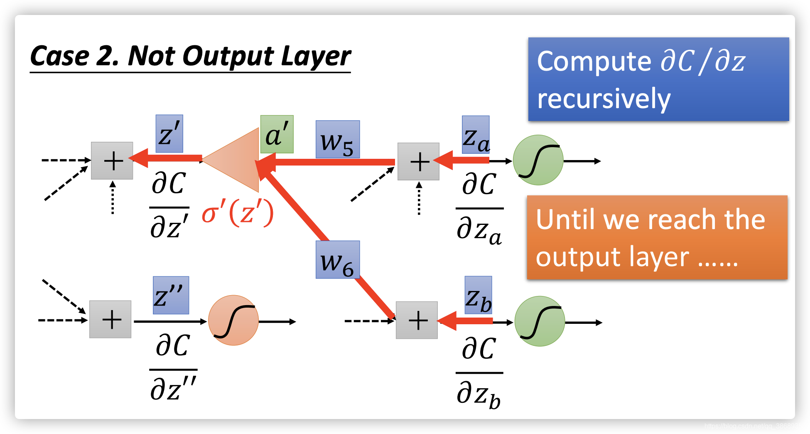

**反向过程**

- 所以直接从Output Layer开始反向计算，就可以极大的提升效率

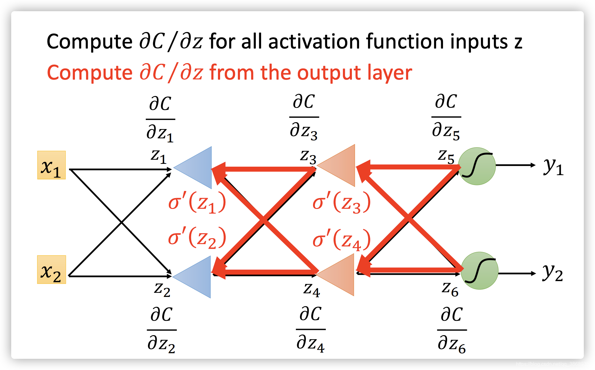

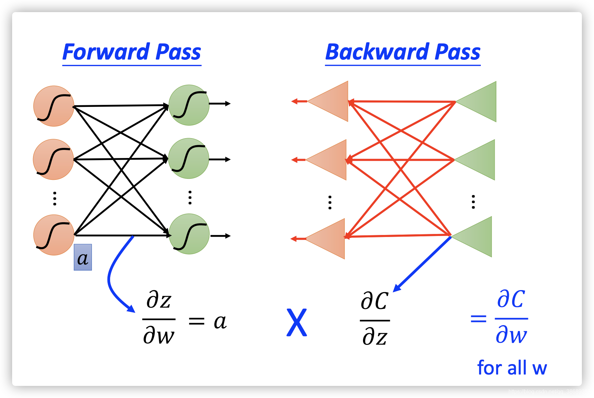


# 感知机

`Perceptrons`

- 感知机本质上是一种**线性分类模型**（linear model）
  - 其实就是**两层神经元组成的神经网络**
- 使用**MCP模型**对输入的多维数据进行二分类


- 它只有output layer进行了激活函数的处理，即只有一层功能神经元（function neuron），学习能力有限，**只能处理线性分类问题**，就连最简单的XOR（异或）问题都无法正确分类

  - 只有线性可分的时候感知机才能达到收敛，异或问题是线性不可分的，需要使用多层感知机才能解决

- 是支持向量机算法的基础

$$
f(x)=sign(w*x+b)
$$

$$
sign(x)=
\left\{
\begin{aligned}
+1, \quad x\ge0\\
-1, \quad x\lt0\\
\end{aligned}
\right.
$$

> 
>
> Model Bias：Linear models have severe limitation（表达能力弱）

- 输入层
  - 特征向量
- 隐含层
- 输出层
  - 分类结果

## 多层感知机

`Multilayer Perceptrons`：MLP

- 有多个hidden layer的感知机
- 可以使用反向传播BP算法，然后使用Sigmoid激活函数进行非线性映射，解决非线性分类和学习的问题

> hidden layer 和output layer都是function neuron


# 卷积神经网络

`Convolutional Neural Network`：CNN

-  Network Architecture designed for **Image Classification**

> Alpha go：围棋和图片也有共性

Image

- 图片的像素点由RGB三色组成，所以一张图可以看成是RGB的三个channel叠加而成
  - 每一个channel由RGB中的一个颜色组成
- 所以可以图片可以看成一个**三维的tensor**（张量）
- 将这个三维的tensor**拉直拼接**就组成了一个NN的input vector
  - 假设图片长宽为100，那么input vector就是`100*100*3`

> 黑白图片的channel就等于1

**问题**

- Fully connected的NN需要的参数太多，太过复杂

**所以要使用CNN来简化神经网络的架构**

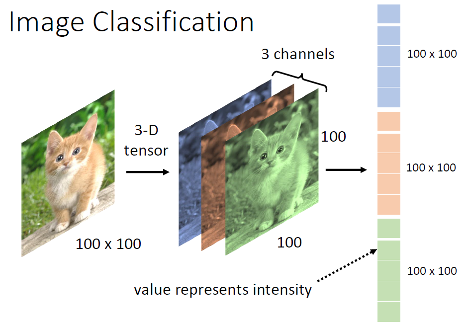

## Receptive field

机器和人都是通过图片的一些critical patterns来识别分类，而这些patterns是不需要看整张图片的

- 即图片中的大部分都是无用的信息，只要把图片中的一部分有用信息作为输入就可以了，如
  - 嘴巴
  - 爪子
  - 眼睛

> patterns are much smaller than the whole image

### 简化

让每一个neuron只关注一部分，称为Receptive field

- 这一部分即patterns对应的图片区域
- 然后将这一部分的数据拉直，作为input vector输入对应的neuron

> 图中选择一个`3*3*3`的Receptive field，所以对应参数就减少为`3*3*3`，将它输入对应的neuron
>
> 增加了对neruon的限制：只关注一部分区域

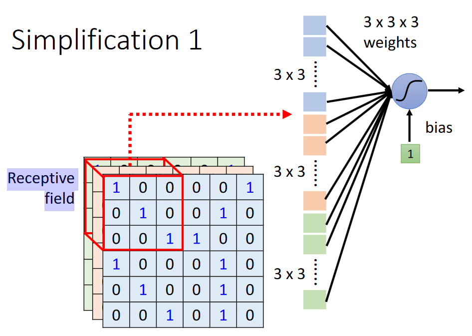

**Receptive field**

1. 不同的neuron可以对应相同的Receptive field
2. 不同的neuron对应的Receptive field大小可以不同
   1. 维度也可以不同（不同的channel个数）
   2. 各种形状均可
3. 不同的neuron对应的Receptive field之间可以重叠 

### 设计

1. Receptive field一般会考虑所有的channel（默认深度一致，均为3），所以只需要指定长和宽即可
   1. **长和宽称为kernel size**
2. 同一个Receptive field一般由一组neuron负责关注处理
3. 一般通过移动（上下，左右）一个Receptive field来作为新的Receptive field
   1. **移动的步长就称为stride**（hyper parameter）
   2. 一般不同的Receptive field之间都会有高度的重叠，否则边界的pattern无法被检测到
   3. 如果移动后，有一部分超出了图片的范围，那就要对超出部分做补0处理
      1. **补0处理称为padding**
4. 通过移动就会覆盖图片的所有地方

这个在Receptive field区域检测的过程就称为**卷积（Convolution）特征提取**

这个指定长和宽的部分就称为**卷积核（Convolution Kernel）**

卷积特征提取就通过卷积核实现

> 卷积特征提取利用了自然图像的统计平稳性，即这一部分学习的特征也能用在另一部分上

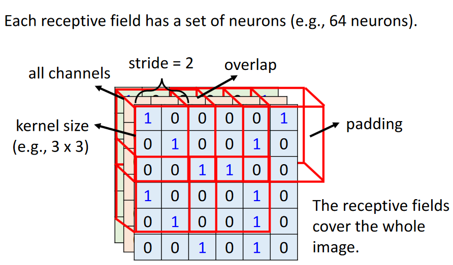

## Parameter sharing

**问题**

- 不同的pattern在不同的图片会出现在不同的地方，所以pattern所在的Receptive field会由不同neuron负责处理，这样就需要每一个Receptive field都有一个neuron来处理这个pattern，冗余

### 简化

- 让负责不同的Receptive field的neuron之间共享参数
  - Receptive field是不一样的，但是它们的weight是完全一样的
- 因为不同的neuron负责不同的Receptive field，所以它们的input vector也是不同的，所以相同的weight也会得到不同的output vector
  - 同一个Receptive field的neuron不会共享参数
- 不同的Receptive field的每个neuron之间共享参数
  - 多个参数构成一个向量（矩阵），称为一个filter
  - filter的值是通过学习得到的

> 增加了对neruon的限制：无法选择参数
>
> 不同的Receptive field的相同颜色的neuron就共用一组参数，filter

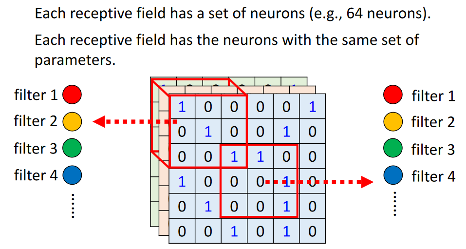

filter对应的tensor是一组参数值

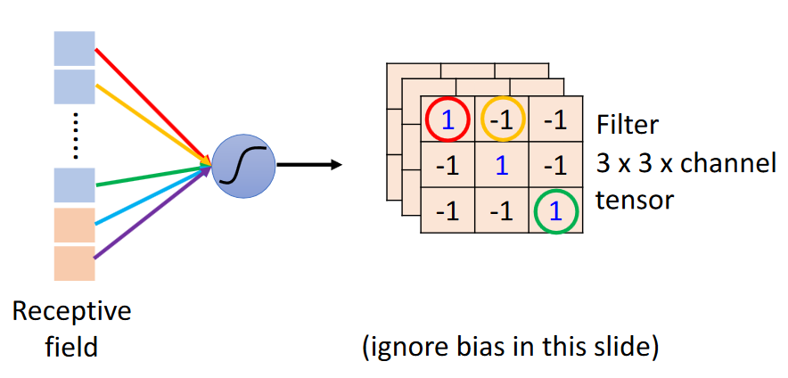

**总结**

- 在Fully Connected Layer上应用Receptive Field和Parameter Sharing它就是一个Convolutional Layer，应用了Convolutional Layer的NN就是CNN

> 在处理图像领域的任务，较大的moder bias反而有更好的表现

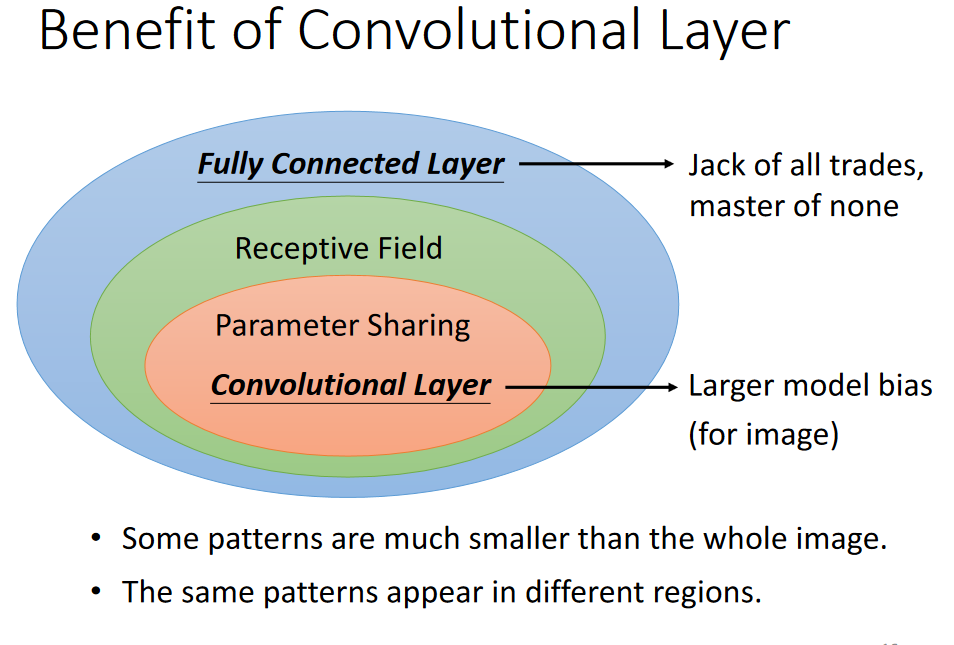  

## Filter

Convolution Layer（卷积层）也可以看成是有很多filter的layer

- 一个filter就是一个卷积核的大小的tensor，作用就是在图片上抓取一个pattern
  - 这个pattern只有在卷积核大小的范围内才会被抓取到
- filter这个tensor里面的数值就是model的parameter，是未知的
  - 通过Gradient Descent来找出值 

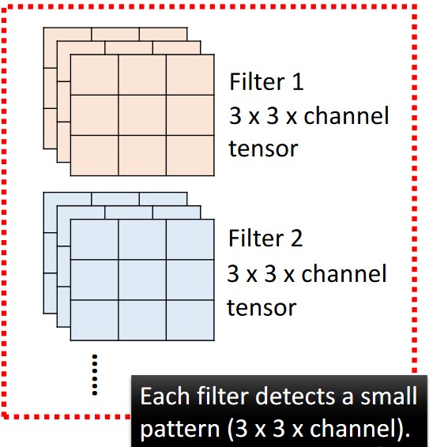

## Feature map

假设filter的tensor里面的数值已经得到，这时候就要用filter在图片上抓取特征

1. 将第一个filter的tensor值和图片对应的Receptive field的值做卷积运算
   1. 一个Receptive field得到一个值
2. 然后将这个filter移动stride到达新的Receptive field，继续做卷积运算，知道覆盖了整个图片
   1. 得到第一个filter计算出来的一层channel的值
3. 然后再用剩下的filter计算......

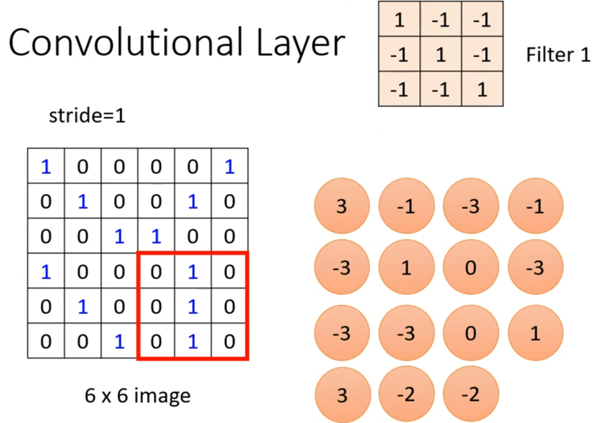

**所有的filter对整个图片运算完就得到feature map**

- 这个feature map的channel数就是filter的个数

即一张图片通过一个Convolution Layer的众多filter运算后，就会得到一个feature map

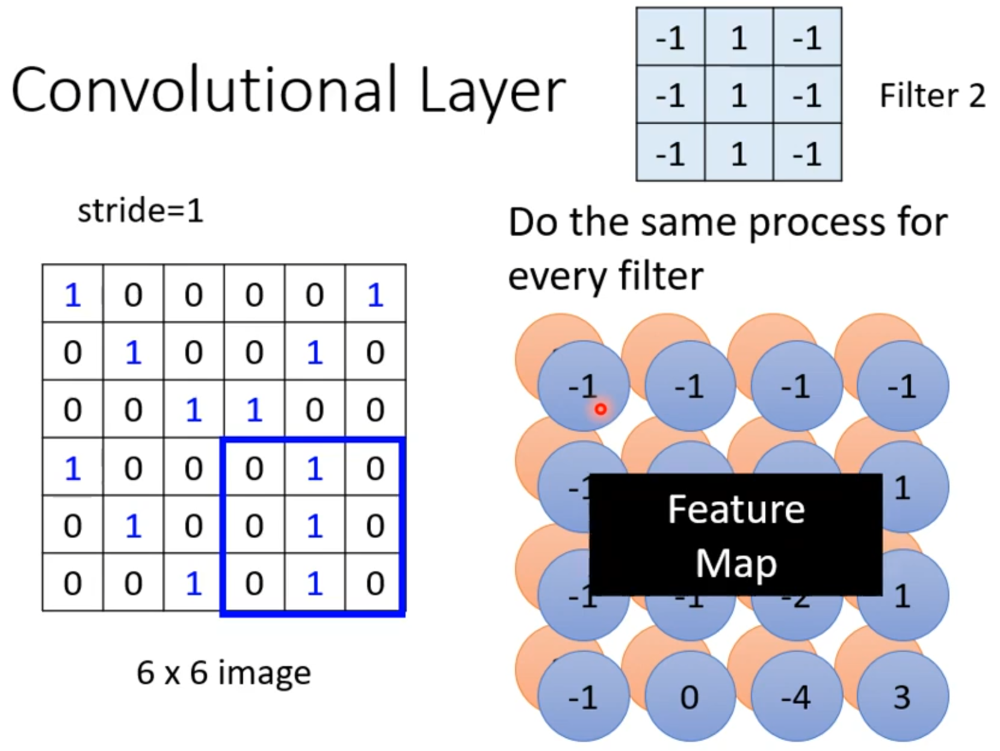

这个feature map就可以看成一张新的图片，但是channel数变多了

- 然后继续将这个feature map输入下一个Convolution Layer
- 此时，后面一个Convolution Layer的filter的深度就必须是前面这个feature map的channel数
  - 所以每次的convolution中的filter都要看上一层中所生成图像的channel数来确定filter的数量

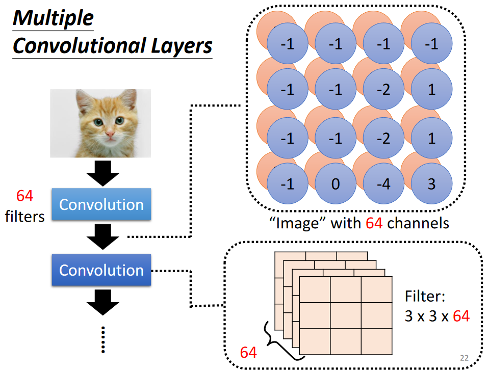

### Receptive field大小

关于Receptive field大小的问题

将feature map看成一张新的图片输入，并且kernel size仍然设置为3

- 此时其实可以看出，`3*3`右下角的位置其实是对应原图片`5*5`右下角的位置
- 即经过一层Convolutional Layers的新的图片，Receptive field的范围变大的
- 所以Convolutional Layers越多，每个filter观察的范围是越来越大的

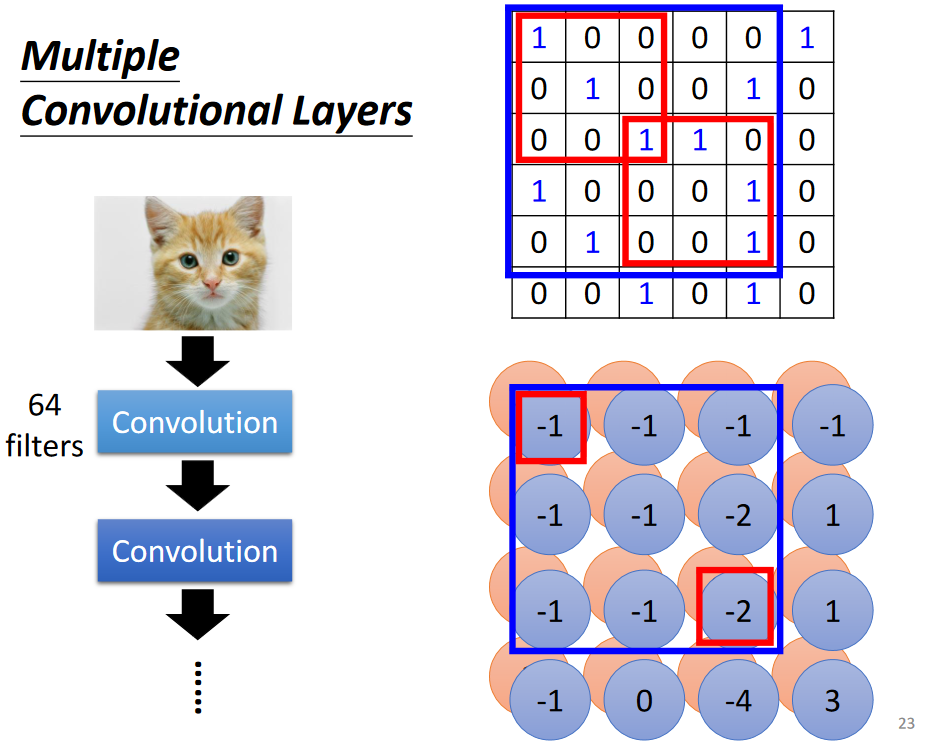

## Pooling

池化：下采样

pooling就是做subsampling，目的是减少运算量

1. 将卷积后得到的feature**划分为几个区域**
2. **在每个区域中选取一个代表值**，组成一个新的特征矩阵（feature map）
   1. Max Pooling：取最大值
   2. Mean Pooling：取平均值

- 用新的特征矩阵来参与后续运算
  - channel数不会变

> Subsampling the pixels will not change the object
>
> - 例如将图片的偶数行和奇数列都去掉，图片会变成原来的1/4，但是不会影响到图片本身的内容
>
> pooling不是一个参数，也不需要学习，类似于激活函数的作用

  可以进行多次卷积和池化操作

- 可以进行几次卷积操作后就进行一次池化操作
- 现在算力足够强，可以不使用池化层，CNN全部由卷积层构成 
  - Alpha go就没有用pooling

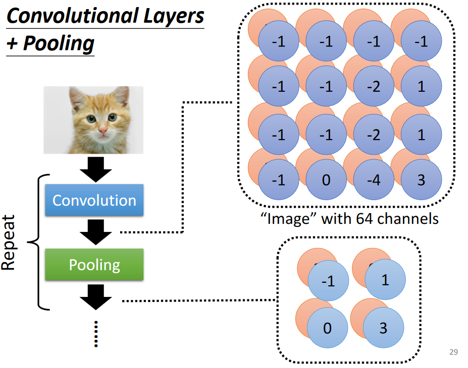

## Flatten

将新得到的feature map拉直（Flatter）成一维的参数向量，然后放到fully connected network里面进行训练，最后得到分类结果


# 自注意力机制

`Self-Attention`

**问题**

- Input不再是一个vector，而**是一个变长的向量序列**，这一个**向量序列就称为一个Sequence**

> 如文字处理，输入是一个句子，将每个句子的每一个词汇表示成一个向量，这样模型的输入就是一排向量序列
>
> - 通过编码将词汇表示成一个向量的表示方法不能表示语义信息，并且维度还非常大
> - 另一种表示方法是词嵌入向量word embedding
>
> 图结构也可以是一个变长的向量序列

**输出**

对于变长的向量序列输入，就会有不同的输出，输出分为三种类型

- 每个输入的向量都在输出中对应一个标签
- 整个输入的向量序列在输出中就对应一个标签
- 由机器自己决定向量序列在输出中对应的标签数量
  - 这种称之为**seq2seq**


## Sequence Labeling

**序列标注**：每个输入的向量都在输出中对应**一个标签**

**问题**

- 不能直接用fully connected network来做
- 因为在fully connected network中，同样的输入会得到同样的输出

> 比如词性标注中：“I saw a saw”第一个“saw”是动词，第二个“saw”是名词，此时同样的输入应该是不一样的输出

**解决方案**

- fully connected network考虑更多的信息，比如上下文信息Context

- 可以设定一个窗口大小，把窗口中的向量一起输入到fully connected network中

**问题**

- 要建立输入向量序列的**长依赖关系**，所以模型要考虑**整个向量序列**的信息
- 但是窗口大小始终是有限的，如果要考虑整个sequence就会出现问题
  - 因为sequence是变长的，而且窗口太大，参数就会变大，运算量就会变大，并且容易overfitting

> **通常可以使用卷积网络CNN或循环神经网络RNN进行编码来得到一个相同长度的输出向量序列**
>
> 基于卷积或循环神经网络的序列编码都是一种局部的编码方式，**只建模了输入信息的局部依赖关系**
>
> 虽然循环神经网络理论上可以建立长距离依赖关系，但是由于**信息传递的容量以及梯度消失问题**，实际上也只能建立短距离依赖关系


## Self-attention函数

Self-attention会考虑整个sequence的信息

- **进过Self-Attention的输出序列长度是和输入序列的长度一样的，并且对应的输出向量考虑了整个输入序列的信息**
- 然后将考虑了整个sequence的输出向量输入到fully connected network中做后续处理

> fully connected network专注于处理某一个位置的信息

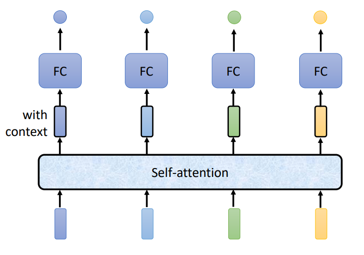

Self-Attention可以和fully connected network交替使用多次以提高网络的性能

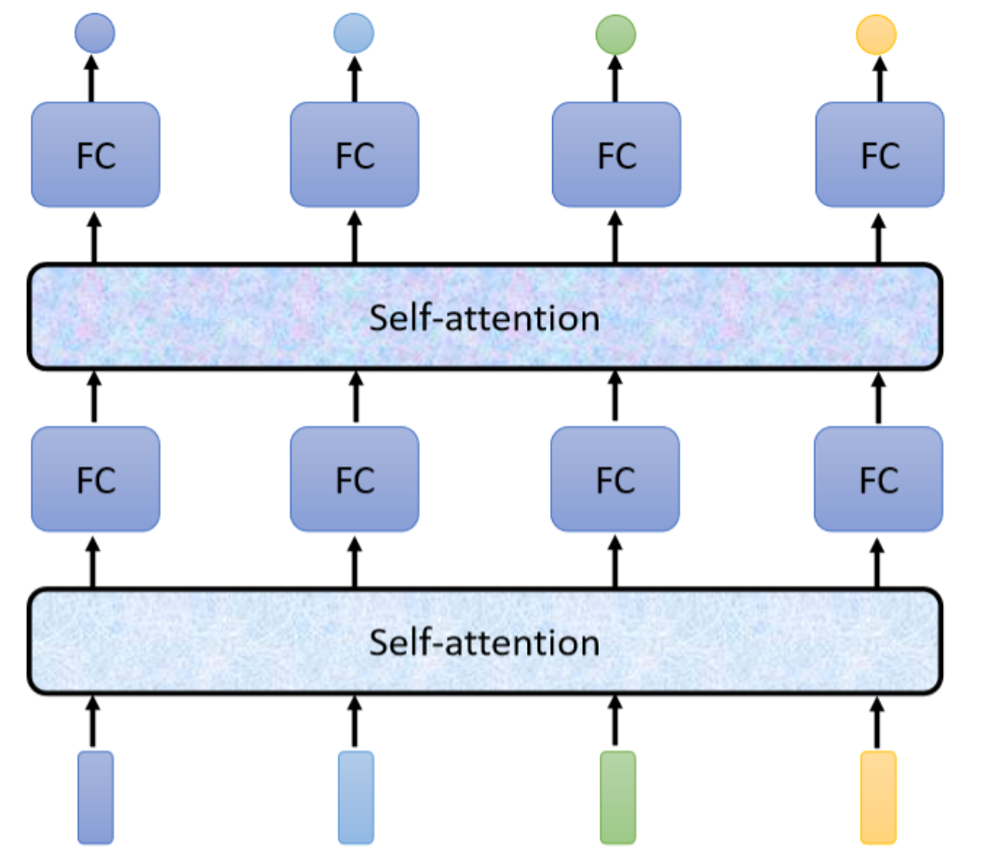

## 工作原理

Self-Attention的输入可以是原始的sequence，也可能是hidden layer的output sequence（有可能前面做过一些处理） 

- Self-attention对应一个输入向量的输出向量，都是考虑了所有的输入向量生成出来的

> 以b1为例，首先要根据b1的输入a1找到sequence中其它和a1相关的向量

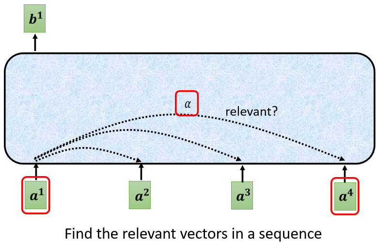

### 相关性分析

Self-Attention的相关性分析计算模组一般有两种

- Dot-product
- Additive

将2个向量输入到module中，就会输出向量之间的相关性α

> 相关性用α表示

#### Dot-product

1. 将两个向量分别和不同的权重矩阵相乘得到向量q和k
2. 然后将向量q和k做点积运算得到一个标量，就是α

> 最常用的方法，用于transformer中

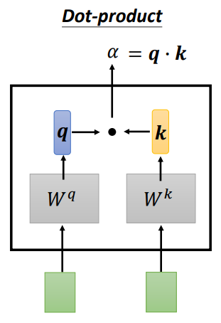

### Additive

1. 将两个向量分别和不同的矩阵相乘得到向量q和k
2. 然后将向量q和k串起来输入到一个激活函数（tanh）中
3. 再通过一个矩阵进行线性变换得到α

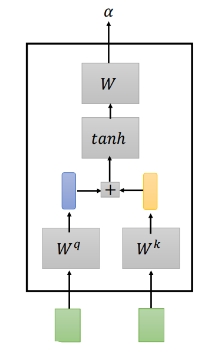


### QKV模型

Query-Key-Value

- 为了提高模型能力，自注意力模型经常采用**查询-键-值模型**

**attention score**

1. 将a1和矩阵Wq相乘得到q1
   1. **q1被称为query**
2. 然后将其他向量a2和矩阵Wk相乘得到k2
   1. **k2被称为key**
3. 然后**将q1和k2做点积运算**得到（α1，2）
   1. **（α1，2）就被称为attention score**，表示a1和a2之间的相关性
4. 然后计算其他剩余的向量a3，a4和a1的相关性

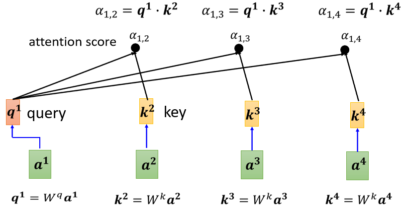

**softmax**

- 在计算完a1和所有向量的相关性之后，将得到的相关性α输入到softmax中得到α’，然后利用α’来抽取出这个sequence的信息
  - 根据attention score可以知道sequence中哪些向量和a1是最有关系的

> 这个softmax和分类使用的softmax时一样的，使用ReLU或其他激活函数代替softmax也是可以的，根据实际效果来


**抽取信息**

1. 每一个向量分别乘上矩阵Wv得到向量v
2. 将向量v和对应的α’相乘，然后再相加得到b1
   1. 如果某一个向量和a1的相关性很强，那么它的α’就会很大，那么它的v就会接近于b1的值
   2. 即b1中的大部分信息来自于这个v

> 向量v可以看成输入向量a携带的信息编码

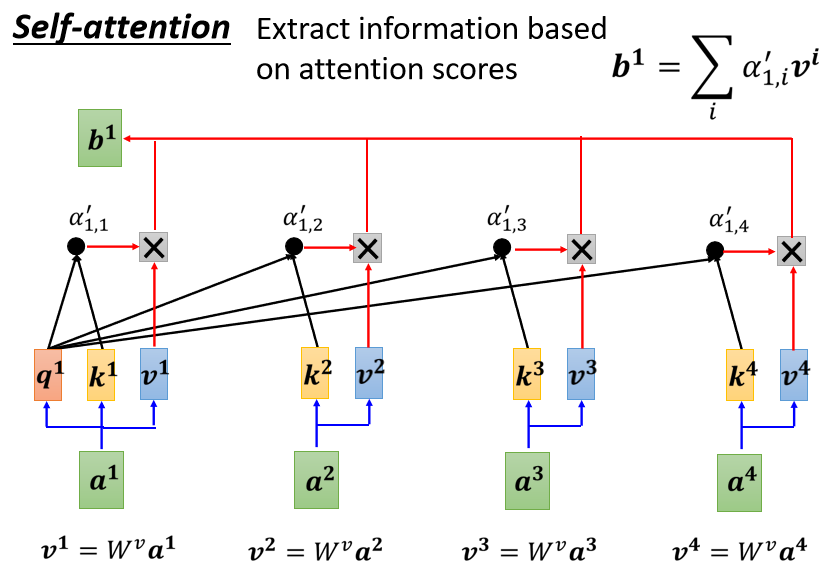

**注意**

- 在计算b1的时候，b2，b3，b4也都会同时被计算出来

## 矩阵计算

**计算QKV**

- 每个输入向量ai都会和矩阵Wq相乘得到qi
- 每个输入向量ai都会和矩阵Wk相乘得到ki
- 每个输入向量ai都会和矩阵Wv相乘得到vi

将输入向量ai拼接成矩阵，再乘以不同的权重矩阵，就可以得到Q，K，V

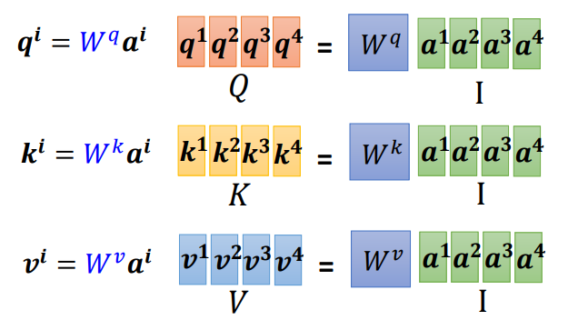

**计算相关性α**

是qi和ki分别做点积

- 将ki拼接成矩阵K
- 将qi拼接成矩阵Q

用KT*Q得到相关性矩阵A，再经过softmax对A进行normalization，得到A'

> 对A中的每一列（对应一个qi计算的α）做softmax

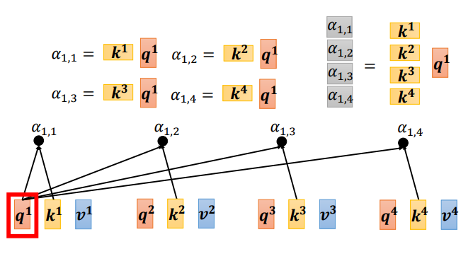

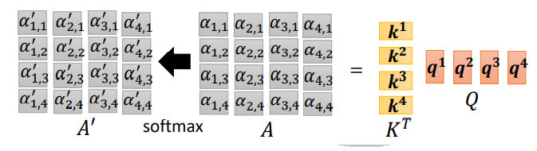

**计算输出**

- 将vi拼接成矩阵V
- 用A'和V相乘得到self-attention的输出矩阵O

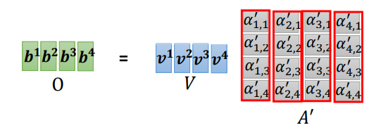

**整个self-attention的计算流程**

- 只有Wq，Wk，Wv三个权重矩阵是未知参数，需要通过数据训练找到
- 其余的都是人为设定好的参数

> A就是一个L*L的矩阵，L是sequence的长度

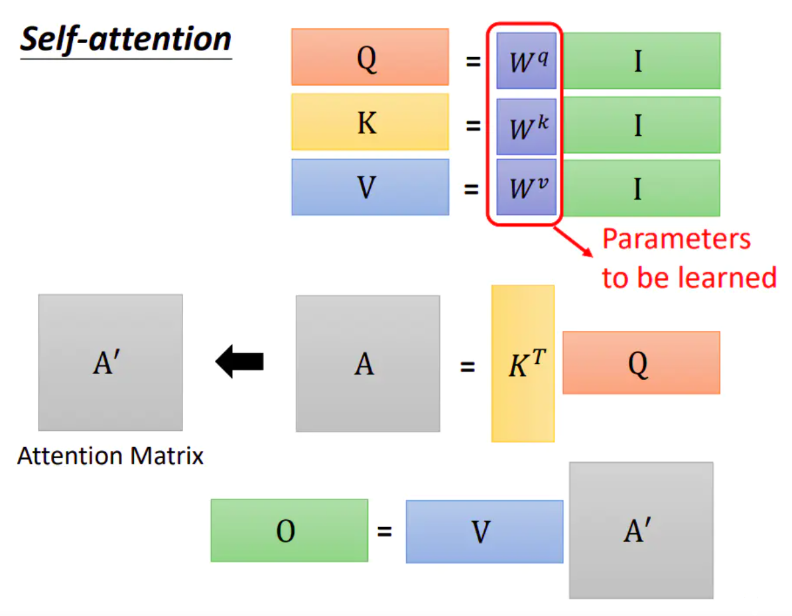

## Multi-head Self-attention

多头自注意力机制：Self-Attention的进阶版

- Self-attention在**找寻相关性的时候就是用qi去找ki**

- 但相关性并不一定只有一种形式，在不同的形式下会有不同的定义
- **多种相关性体现到计算方式上就是有多个矩阵（qi，j）**
  - **不同的（qi，j）负责代表不同的相关性**

> head的个数也是一个hyperparameter

计算方式

- 将qi和不同的矩阵（Wq，j）相乘，得到不同的（qi，j），表示不同的相关性
  - （qi，j）的j表示是第j个head
  - （Wq，j）的j表示对应的（qi，j）
    - **几种相关性就有几个head**
- **有几个（qi，j），就对应用几个（ki，j）和（vi，j）**

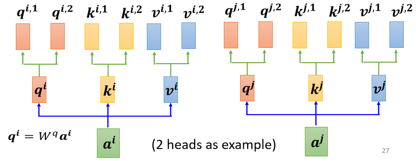

后续的计算中，**只将属于相同相关性的矩阵进行运算**

计算第一种相关性

- （qi，1）分别和（ki，1），（kj，1）点积得到（α1，1，1），（α1，2，1）
- （α1，1，1）和（α1，2，1）分别再和（vi，1），（vj，1）相乘得到（bi，1）

同理得到第二种相关性（bi，2）

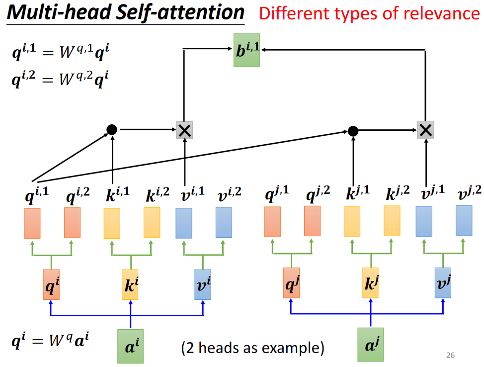

最后将（bi，1）和（bi，2）拼起来的矩阵再乘以一个矩阵Wo，就得到最终的output bi


## Positional Encoding

**问题**

- 整个过程中Self-attention layer少了一个重要的信息，即**位置信息**
  - 输入向量位于整个sequence的哪个位置是未知的
  - 进行矩阵运算的时候，对于不同的位置的输入，都是同等对待的
- 没有说像RNN那样**后面的输入考虑了前面输入的信息**，也**没有考虑输入的距离远近**

**解决方案**

- 加入位置信息：为每个位置的输入都设定一个独立的位置向量ei
  - ei是通过sin和cos函数形成一个公式生成的
- 将位置向量ei加上到输入向量ai

> 也有其他的生成方法，甚至可以当成一个可以学习的参数

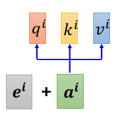


## 对比CNN

CNN可以看成是一个简化版的Self-attention

- CNN在做卷积的时候，考虑的是Receptive field内的信息

- 而Selt-attention考虑的是整个输入的信息

> Self-attention只要设置合适的参数，就可以做到CNN能做到的事情


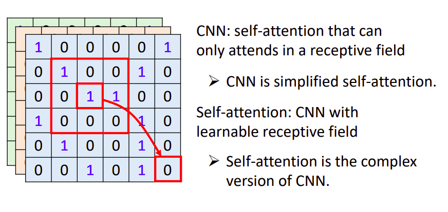

## 对比RNN

Self-attention和RNN都可以处理序列数据

- RNN得到结果时必须按照时间步的顺序（正序或逆序）来生成
  - RNN无法并行处理所有的输出
    - 影响到训练的效率
  - RNN很难考虑到比较远的输入
    - 要考虑很远的输入就必须保存到内存中，然后一步一步传递

> 利用双向RNN的设计可以考虑整个序列信息

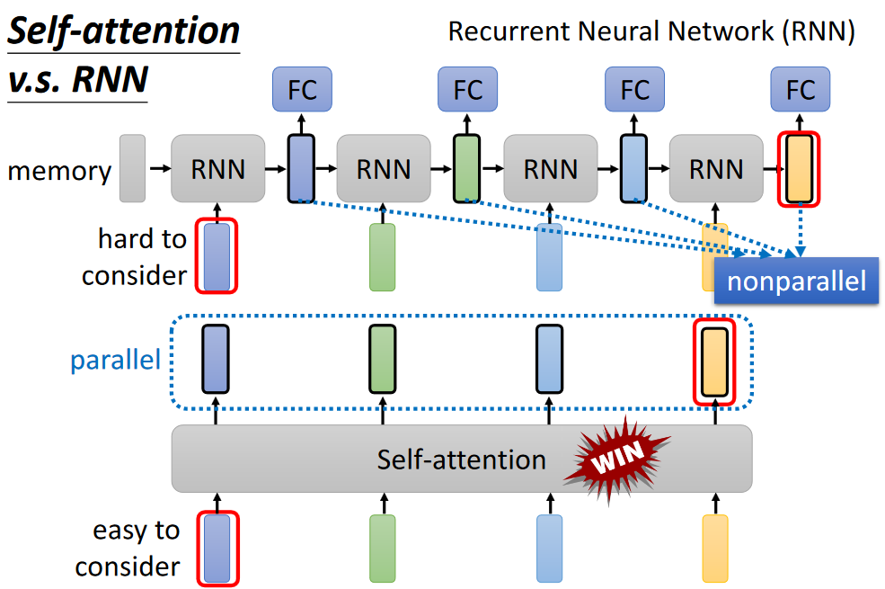


## Graph

Self-attention还可以用在图结构上

- 图中每个节点看成一个输入
- 图结构中的边可以看成有关联的向量，就可以形成一个稀疏矩阵

只对邻接的节点做相关性计算


# Transformer

Transformer就是一个Sequence to sequence（**Seq2seq**）model

- 由机器自己决定向量序列在输出中对应的标签数量

Transformer的整个结构可以分为两部分

- **编码器**：Encoder
- **解码器**：Decoder

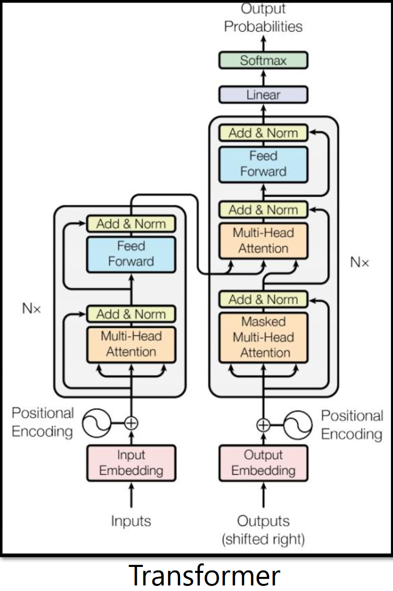

**处理过程**

1. 输入一个sequence
2. 由Encoder负责处理这个sequence
3. 把处理好的结果输入Decoder
4. 由Decoder决定它要输出什么样的sequence

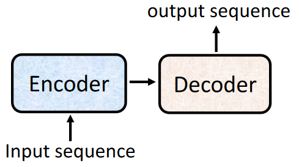

## Encoder

Encoder的作用就是**输入一个向量序列，输出另一个向量序列**

- **Transformer中使用Multi-Head attention模型来作为Encoder**

> 能实现这个功能的模型还有CNN和RNN等

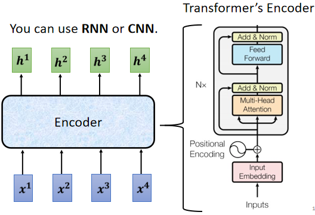

在Transformer的**Encoder中会有很多个block**

- 每一个block都是**输入一个向量序列，输出另一个向量序列**到下一个block

**每一个block并不只是neural network中的一个layer，而是好几个layer**，每个block中都包含了Multi-Head Self-Attention和Fully Collection

- 输入的向量序列先经过self-attention，在考虑整个sequence的信息后，输出一个向量序列
- 然后将输出的这个向量序列输入到Fully Connected Feedforward NetWork中，得到处理后的向量

Transformer中，**在Multi-Head Self-Attention和Fully Connected Feedforward NetWork上还额外加了residual connection和layer normalization**

- residual connection：将输入向量加到输出向量上，即Add
- layer normalization：将Add后的输出向量标准化
  - 计算输入向量的mean跟standard deviation
  - 把向量的每一个分量减去mean，再除以standard deviation就得到标准化的结果

> 在最开始输入的时候，还会有Positional Encoding加上位置信息
>
> 整个操作就会重复block个数的次数
>
> 这是最原始的Transformer的encoder的network架构

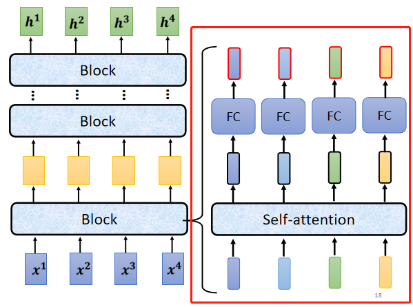

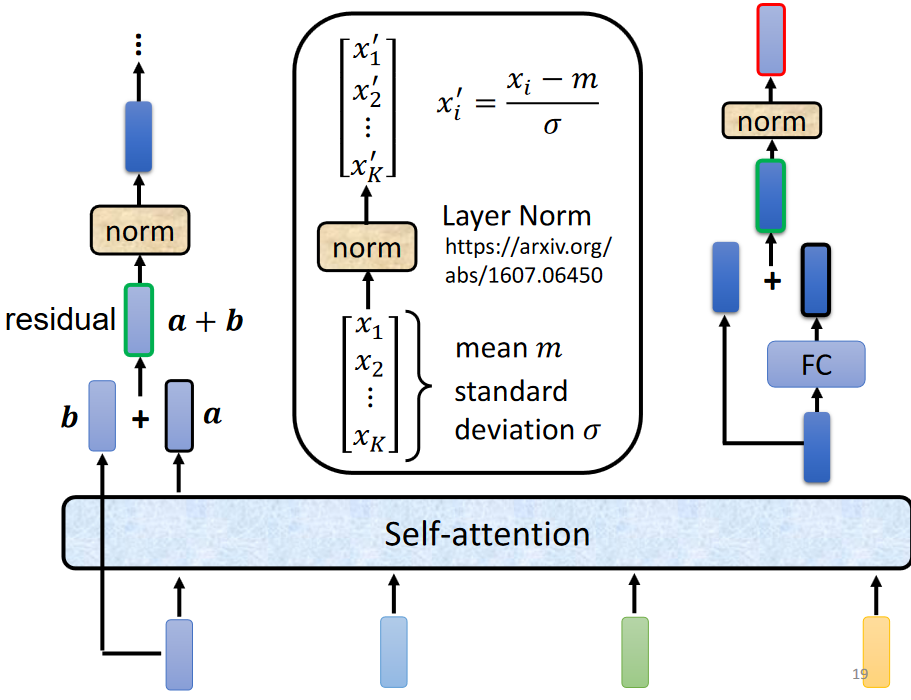


## Decoder

Decoder有两种

- **AT**：Auto regressive
- **NAT**：Non-Auto regressive

> AT应用范围更为广泛一些

### Auto regressive

**每一个输入都用One-Hot Vector表示**

- 并设定START和END两个special token，其中**START表示开始工作，END表示结束工作**
- START和END也可以共用一个special token

> One-Hot Vector：仅将正确解的标签设为1，其他都是0的向量，如[0,1,0,0,0,0]

**处理过程**

1. 在Encoder完成处理之后，就将其输出作为一个输入喂到Decoder中，同时输入一个special token：START，来表示开始工作
2. Decoder结合这两个输入，**输出一个经过softmax处理后的长度为Vocabulary Size的输出向量**
   1. Vocabulary Size是根据任务自己选择的
   2. 要包含START和END这两个special token
3. 该向量中每一个分量都会对应一个值，**值最大的分量就作为最终输出的结果**
4. 然后将这个结果作为一个新的One-Hot的Vector，输入到Decoder中
5. **Decoder会考虑之前的输入和这个新的输入**，再做处理得到输出
6. 然后重复步骤4，5，直到Decoder输出的结果为END对应的special token
   1. **每次都会考虑之前所有的输入和新的输入**
   2. 最后的Vocabulary Size的输出向量中，END对应的值必须要最大

> 因为Decoder会将前一步的输入作为下一步的输入，所以如果前一步输出错误，那么可能会造成error propagation
>
> 整个过程中Decoder也有考虑Encoder的输出信息

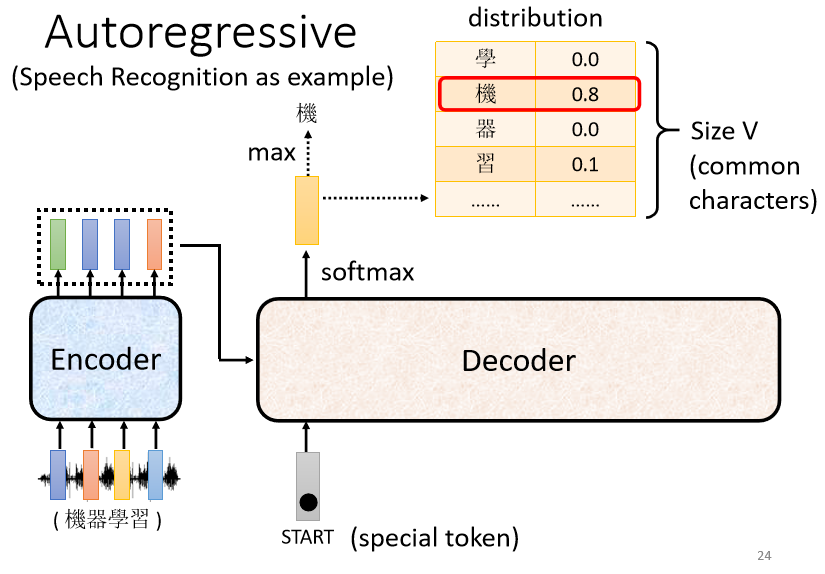

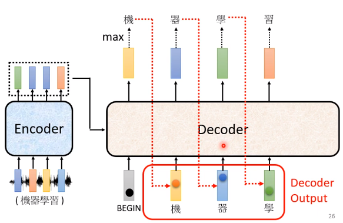

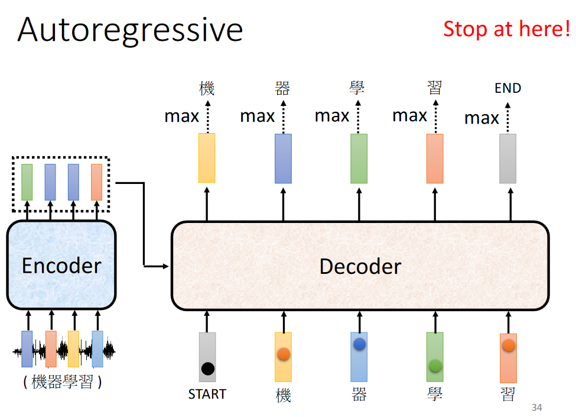

### Decoder结构

相比较Encoder

- 在遮住中间的Multi-head Self-attention，两者几乎相同

- 区别只在Decoder的**第一个自注意力机制**使用了**Masked Multi-head Self-attention**

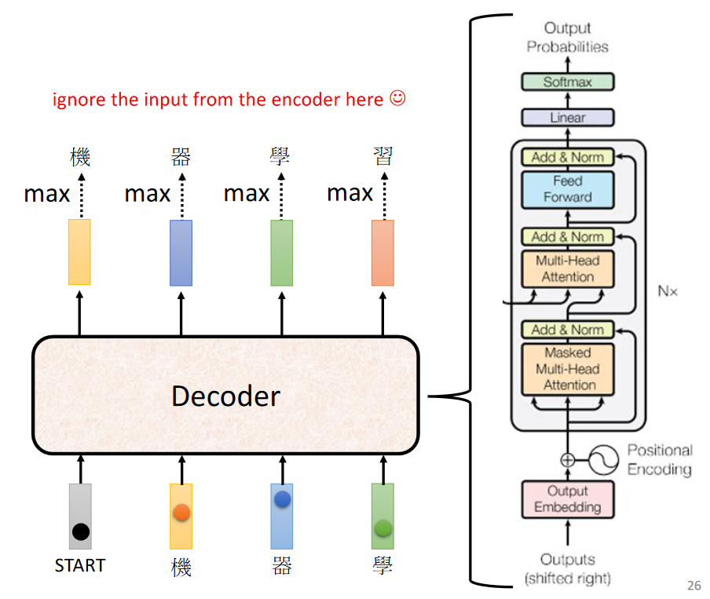

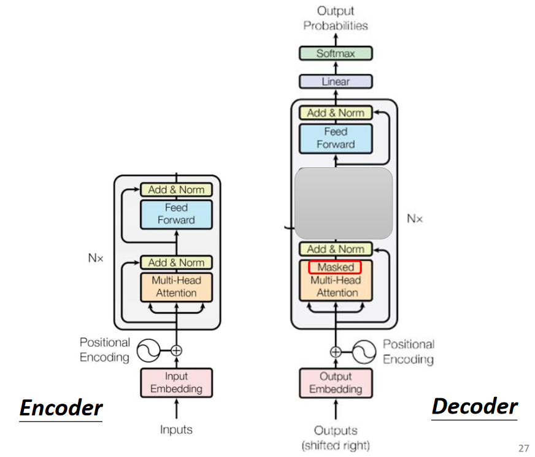

### Masked Multi-head Self-attention

在计算相关性的时候，**每次只能考虑自己左边的部分**

- b1只看a1，b2只看a1和a2，b3只看a1，a2和a3，b4可以看到全部的ai

因为在Decoder的处理过程中，每一次处理都只考虑前面所有的输入，此时右边的向量还有生成出来

- 即**Masked Multi-Head attention的计算顺序和Decoder的串行计算顺序相对应的**

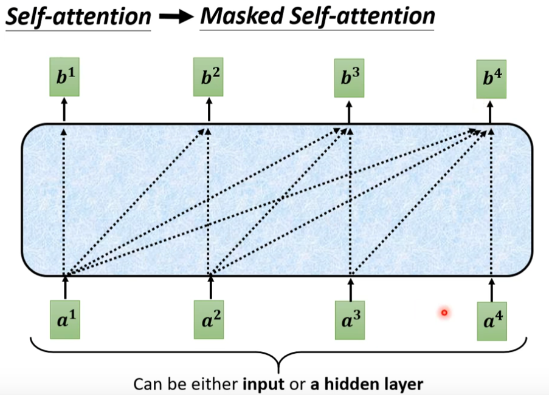

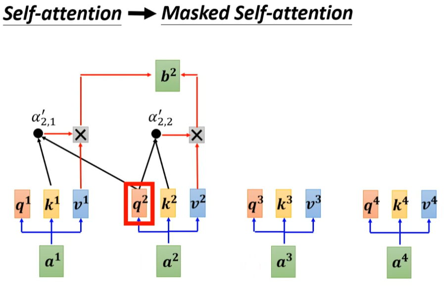

## NAT

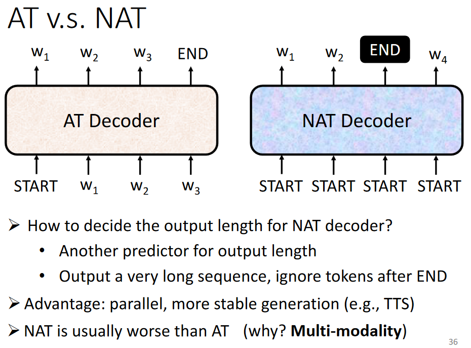

## Cross Attention

**Encoder和Decoder之间的数据传输由Cross Attention负责完成**

Cross Attention中

- Encoder提供了2个输入
  - Decoder从这里读取Encoder的输出

- Decoder提供了一个输入

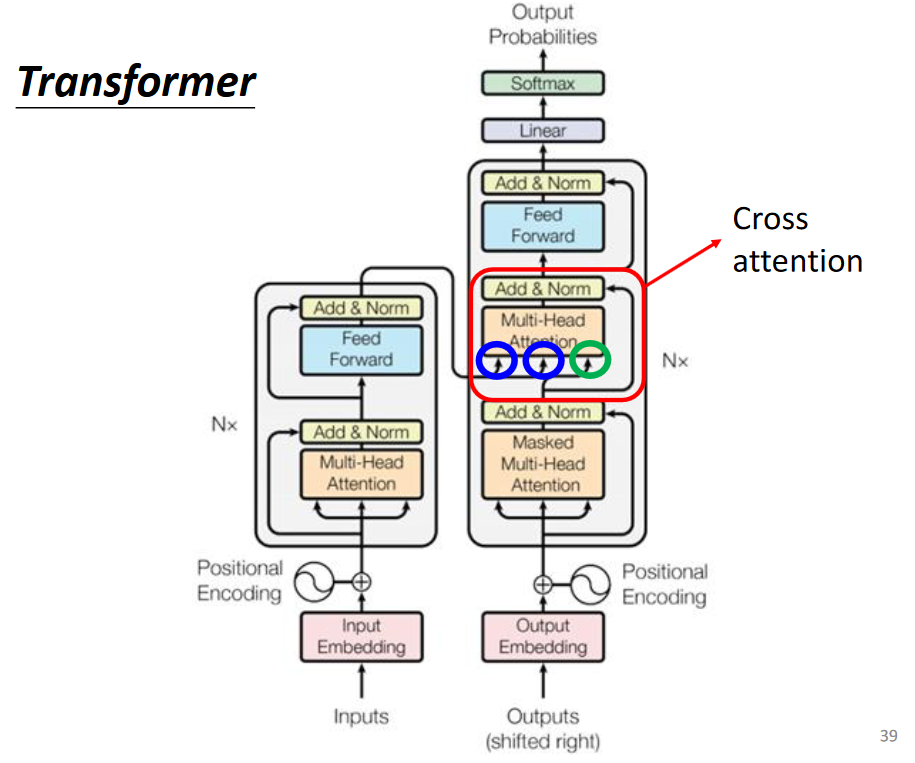

**计算过程**

将Decoder的输入处理得到q，将Encoder的输入处理得到k和v

1. 每当Decoder生成一个结果q，就将q和Encoder输入的k计算Attention Score
2. 再将Attention Score和Encoder输入的v得到V
3. 将V输入到Fully Connected Feedforward NetWork中再处理
4. 重复1，2，3直到Decoder输出END结束

> 这里Decoder使用的是Encoder最后一层的输出，也可以和Encoder的中间其他层做出各式各样的连接

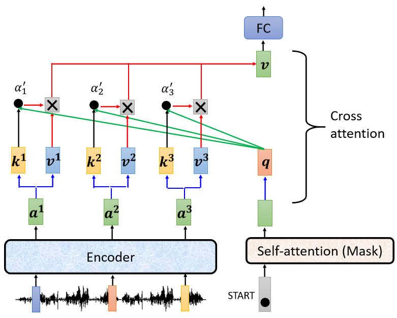


## 训练过程

Decoder的输出是一个经过softmax处理后的长度为Vocabulary Size的输出向量

> Vocabulary Size的分类问题

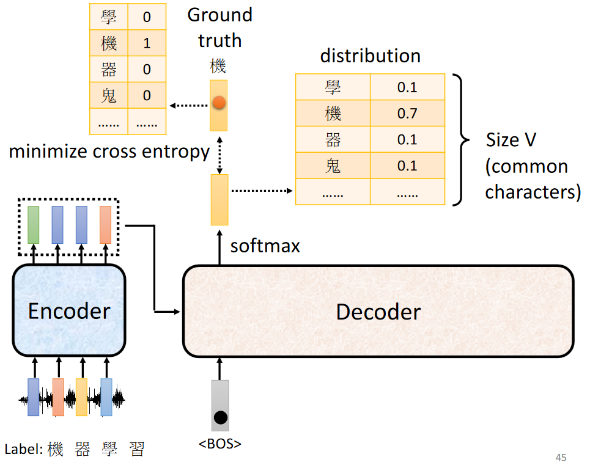


# 循环神经网络

`Recurrent Neural Network`：RNN

**应用**

- Slot Filling：槽填充

> one-hot encoding
>
> - 将词转换为向量
> - 对于没有在词典中的词，统一归类到`other`类别，用`other`的向量表示

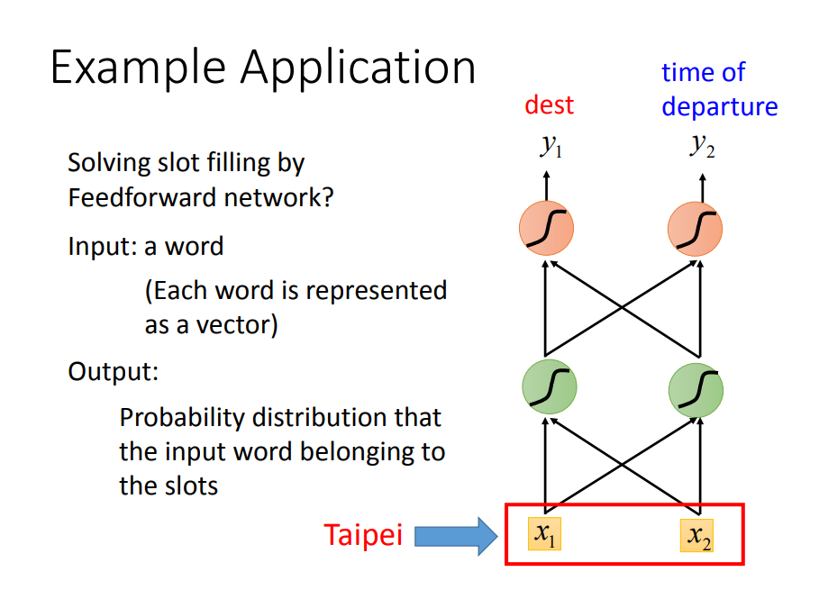

 **问题**

- 如果没有把这句话当做一个序列，用前向传播神经网络的话是**没有考虑到上下文的**
- **前向传播神经网络中相同的input一定是相同的output**

> 要么都是dest，要么都是departure

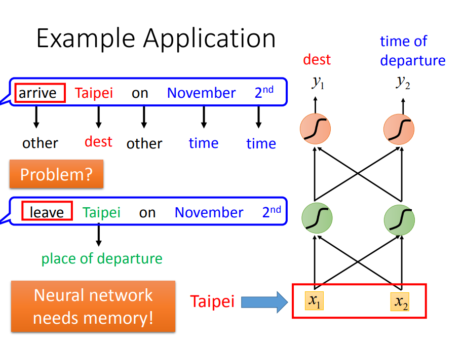

**需求**

- 神经网络是有记忆（**memory**）的：考虑上下文
  - 相同的input，不同的order，也会产生不同的output

> 将地点和前面的动词离开，到达结合

## RNN架构

**memory**：存储上一层的输出

> 下一个输出就会更新memory，所以只能记忆一个时间点的信息

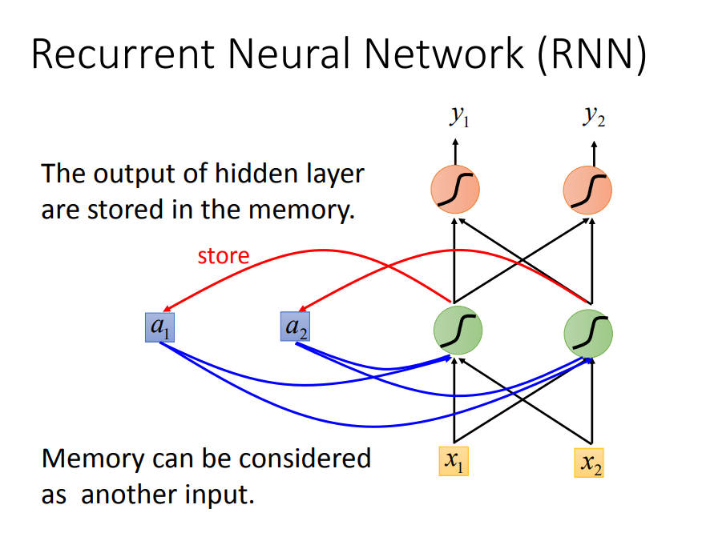

当前输入会考虑上一层的输出，即memory会传递给下一个input vector

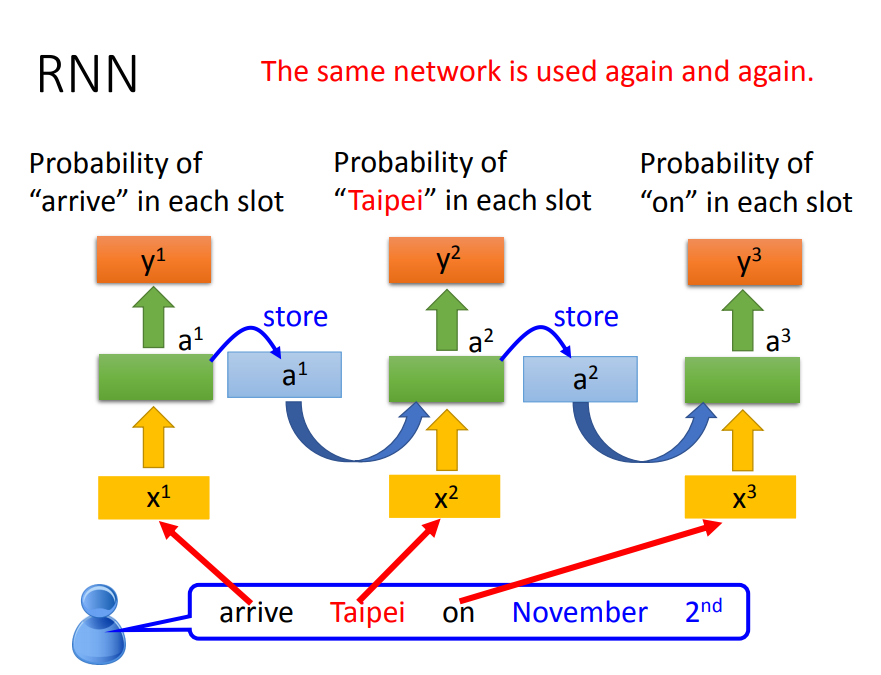

## RNN种类

**Elman Network**

- 考虑每一个hidden layer 的memory

**Jordan Network**

- 将整个输出当成memory考虑

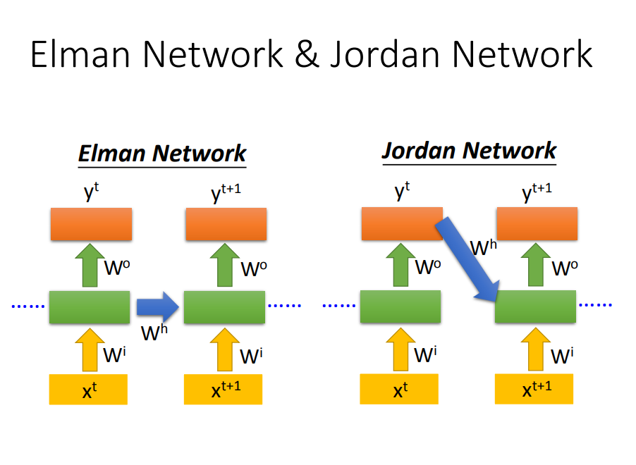

### 双向RNN

`Bidirectional RNN`

- 同时从反向训练一个RNN，这样在考虑某一个input vector xt时，同时考虑正向的memory和反向的memory

> 等于考虑了一整个序列的信息


## LSTM

`Long Short-term Memory`

- **其实还是一个Short-term的memory，只是比较Long**

> 普通的RNN只能记忆一个时间点的信息，即short-term，LSTM有forget gate，所以会long一点

### LSTM架构

**LSTM的memory cell有4个input，1个output**

有三个Gate，Gate的打开和关闭由NN自己学习得出

- input gate：决定是否要存储输入的memory
  - 输入就是某个neuron的输出
- output gate：决定是否要输出这个memory
  - 其它neuron来读取这个memory
- forget gate：决定是否要遗忘存储的memory
  - **forget gate打开代表记住，关闭代表遗忘**

> 4个input分别是要输入的memory和操控三个gate的信号

从forget gate可以看出， LSTM的memory采用的是累加策略，这就意味着，只要产生了影响，这影响始终存在，除非forget gate把memory的值遗忘掉

- 所以LSTM可以解决梯度消失问题（gradient vanishing）

> 最早的LSTM是没有forget gate的

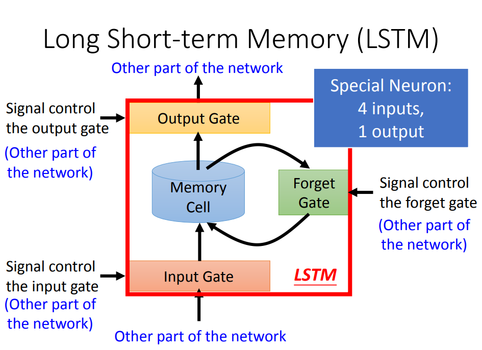

### Memory分析

使用sigmoid函数作为激活函数，因为可以将值映射到[0,1]，从而反应控制门的程度

- memory需要设定初始值

- 使用乘积作为结果输出到cell中（0表示关闭，1表示打开）

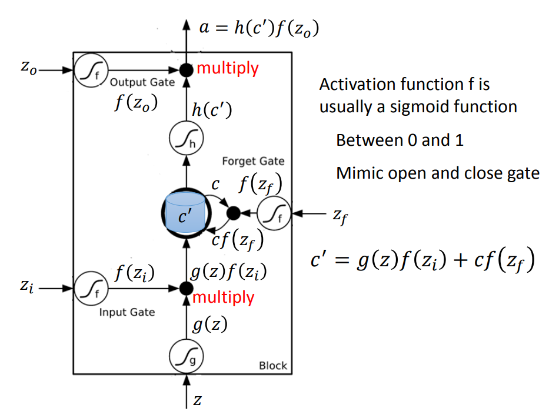

### LSTM和NN

**LSTM就可以相当于普通的NN中的neuron**

- 将输入的向量xt进过线性变换变成对应LSTM的4个输入的4维向量z
- 然后得到一个输出送入下一个LSTM

> 普通的NN中的neuron是一个输入，一个输出
>
> 所以如果LSTM和neuron的数量相同时，LSTM的参数就会是普通neuron的4倍

C是memory cell组成的vector

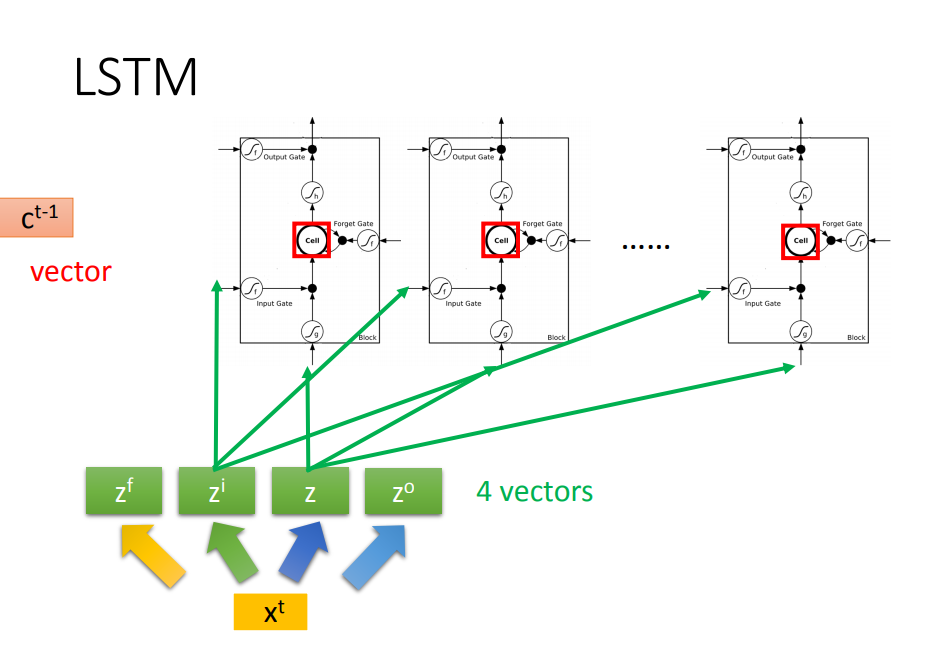

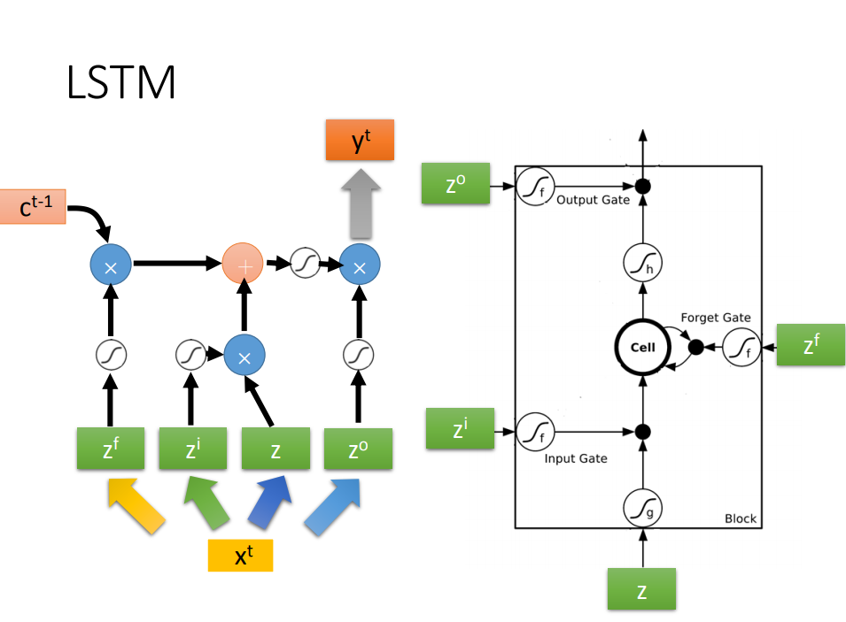

## RNN梯度

RNN会出现**悬崖**（梯度消失或爆炸）问题

- 梯度消失（gradient vanishing）

- 梯度爆炸（gradient explode）

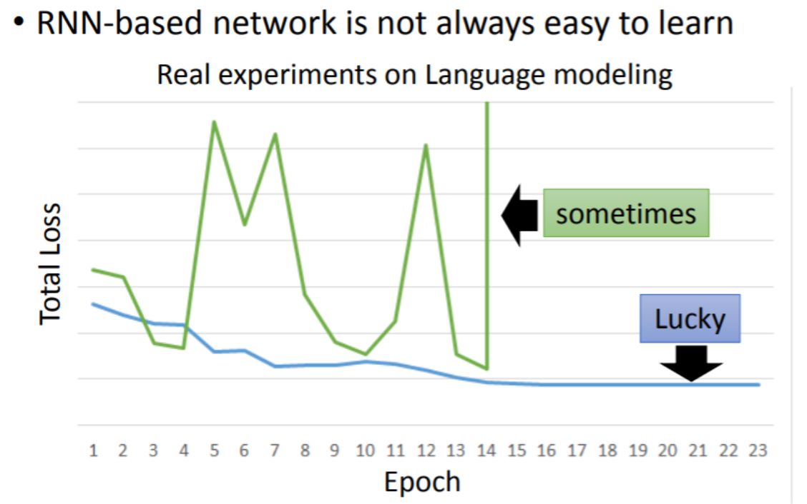

可能变一点就飞出去了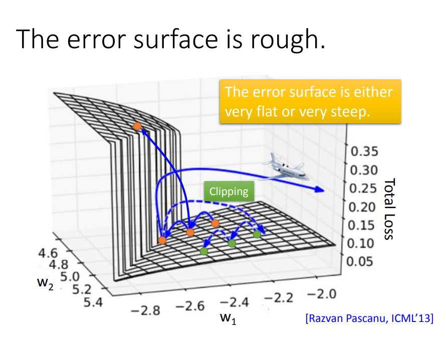

### 梯度消失/爆炸

激活函数

- sigmoid函数不是造成不平整的原因
- ReLU在RNN上表现并不如sigmoid，所以activation function并不是这里的关键点

**原因**

- RNN会把同样的weight在不同时间反复使用

  - 要么不起作用就不起作用

  - 要么起作用就会一直起作用

> LSTM可以解决梯度消失问题（gradient vanishing） ，但不能解决梯度爆炸问题（gradient explode），所以使用LSTM可以把学习率设置的小一点

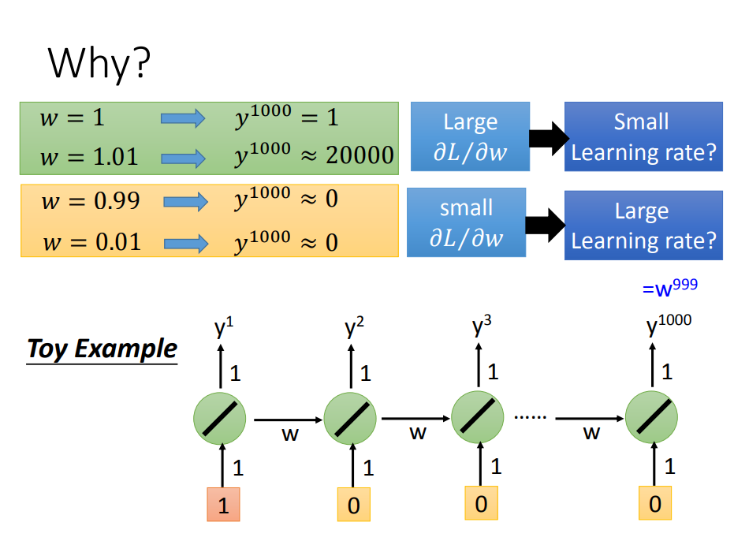

## GRU

`Gated Recurrent Unit`
